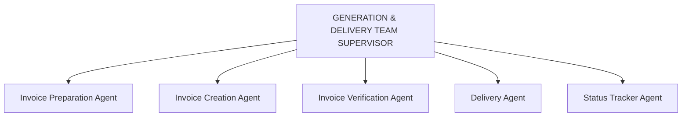

# Design Assessment - BoondManager Multi-Agent Invoice Automation

**Assessment Date:** 2025-10-09
**Reviewer:** System Architect (Design Agent)
**Scope:** Complete architecture review based on existing documentation

---

## Executive Summary

**Overall Judgment: EXCELLENT FOUNDATION with strategic opportunities for enhancement**

The current architecture demonstrates **strong systems thinking** and appropriate use of LangGraph patterns. The hierarchical team structure with map-reduce parallelism is the correct approach for this problem domain. However, there are critical integration points that need refinement based on the newly discovered BoondManager API capabilities.

**Confidence Level:** 8.5/10 - Solid architecture, needs API integration refinement

---

## Strengths of Current Design

### ✅ 1. Hierarchical Team Architecture (EXCELLENT)

**What's Good:**
- Clear separation of concerns across three teams
- Each team is a self-contained subgraph with dedicated responsibilities
- Top-level orchestrator manages workflow coordination
- Middleware layers provide cross-cutting concerns

**Why It Works:**
- Matches the natural decomposition of the invoice workflow
- Enables independent development and testing of each team
- Supports parallel processing at multiple levels
- Allows graceful error isolation and recovery

**Rating:** 9/10

---

### ✅ 2. Reconciliation Team Design (OUTSTANDING)

**What's Good:**
- Map-reduce pattern with worker-level subgraphs
- 50 workers → 50 parallel subgraphs (excellent scalability)
- Each subgraph manages ~10 variables per worker
- Clean fan-out, process, fan-in structure
- Zero-tolerance policy with clear email notification logic

**Why It Works:**
- Solves the state management complexity problem elegantly
- Parallelism provides 10x speed improvement
- Error isolation per worker prevents cascading failures
- Pattern detection in aggregation phase adds intelligence

**Design Insight:**
The decision to use worker-level subgraphs instead of a single monolithic agent is **architecturally brilliant**. This is exactly the right pattern for handling 50+ entities with complex state.

**Rating:** 10/10

---

### ✅ 3. Human-in-the-Loop Integration (WELL-DESIGNED)

**What's Good:**
- Clear interrupt points based on confidence thresholds
- Middleware-based implementation (non-invasive)
- Resume mechanism with state preservation
- Multiple human action options (approve/reject/edit/adjust)

**Why It Works:**
- Provides oversight without blocking automation
- Confidence-based gating is data-driven
- State checkpointing enables resumability
- Clear escalation paths for edge cases

**Rating:** 9/10

---

### ✅ 4. Error Handling Strategy (COMPREHENSIVE)

**What's Good:**
- Three-level error classification (agent → team → workflow)
- Retry policies with backoff
- Graceful degradation (partial results acceptable)
- Clear escalation paths

**Why It Works:**
- Matches error severity to response strategy
- Prevents error cascades
- Enables debugging at appropriate granularity
- Supports production resilience

**Rating:** 8/10

---

## Critical Gap Identified: BoondManager API Integration

### ⚠️ THE BIG DISCOVERY

**Context:** Your invoicing API research revealed comprehensive endpoints that the current design doesn't fully leverage.

**What We Now Know:**
- BoondManager has 18+ specialized invoice endpoints
- Rich search capabilities with 40+ query parameters
- Built-in invoice generation (`POST /invoices`)
- Validation, adjustment, and quality check endpoints
- CSV export and batch processing capabilities
- E-invoicing compliance checking

**Current Design Gap:**
The Generation & Delivery Team design assumes manual invoice generation (template engine, PDF library), but **BoondManager already provides invoice generation as a service**.

---

## Architectural Refinement Recommendations

### 🔧 1. Reconciliation Team → BoondManager Integration

**Current State:** Design mentions "BoondManager API" generically

**Refined Approach:**

#### Phase 1: Project Setup (Enhanced)
```
Step 1: Parse client data (already in design ✓)

Step 2: Query BoondManager for project context
   Tool: GET /api/projects
   Returns: Project ID, metadata, billing status
```

#### Phase 2: Worker Reconciliation (Enhanced)

**Worker Subgraph Tool Chain:**
```
Step 1: Find worker in BoondManager (CRITICAL FIRST STEP)
   Input: Worker name/identifier from client data
   Tool: GET /api/resources?keywords={workerName}&typeResource=1
   Returns: List of matching resources
   Extract: resource.id (BoondManager worker ID)
   Handle: Multiple matches → use additional filters or prompt for clarification
   Handle: No match → flag as unreconcilable, notify admin

Step 2: Get worker times from BoondManager
   Input: workerId from Step 1
   Tool: GET /api/times?resources={workerId}&projects={projectId}&startDate={start}&endDate={end}
   Returns: Individual time entries with dates and hours
   Aggregate: Sum all hours → convert to days (e.g., 8 hours = 1 day)
   Output: boondmanager_days_worked

Step 3: Get worker timesheet report
   Input: workerId from Step 1
   Tool: GET /api/times-reports?resources={workerId}&period={billingPeriod}
   Returns: Validated timesheet data with approval status
   Extract: Days worked, approval status, validation state
   Verify: Timesheet is approved and validated

Step 4: Get project billing rate for worker
   Tool: GET /api/projects/{projectId}
   Cross-reference with: GET /api/resources/{workerId} (worker rate card)
   Calculate: Expected cost = boondmanager_days_worked × worker_daily_rate
   Output: boondmanager_calculated_cost

Step 5: Compare with client data
   Compare: client_days_worked vs boondmanager_days_worked
   Compare: client_total_cost vs boondmanager_calculated_cost
   Tolerance: Exact match required (zero-tolerance policy)
   Output: days_match (boolean), cost_match (boolean)

Step 6: Determine reconciliation status and actions
   Both match → Status: MATCHED, confidence: 1.0
   Days mismatch or both → Status: DAYS_MISMATCH, send email to worker
   Cost mismatch only → Status: COST_MISMATCH, send email to client
```

**State Variables per Worker:**
1. `worker_name_client` - Worker name from client system (search key)
2. `worker_id_client` - Client system identifier (if available)
3. `worker_id_boondmanager` - BoondManager resource ID (from Step 1)
4. `worker_match_confidence` - 1.0 if exact match, <1.0 if ambiguous
5. `client_days_worked` - From client input
6. `client_total_cost` - From client input
7. `boondmanager_days_worked` - From BoondManager API (Step 2)
8. `boondmanager_calculated_cost` - From BoondManager rate × days (Step 4)
9. `days_match` - Boolean (exact comparison)
10. `cost_match` - Boolean (exact comparison)
11. `reconciliation_status` - matched/days_mismatch/cost_mismatch/full_mismatch/worker_not_found
12. `confidence_score` - 1.0 if matched, 0.0 otherwise
13. `email_sent` - worker/client/both/none/admin
14. `error_message` - If worker not found or API failures

**Recommendation:** ✅ **Map specific API endpoints to each tool call in worker subgraph**

---

### 🔧 2. Validation Team → BoondManager Integration

**Current Design:** Generic "mark timesheet validated" mention

**Refined Approach:**

The validation team should use BoondManager's built-in validation endpoints:

```
For each worker (parallel):
   Step 1: Mark timesheet as validated
      Tool: PUT /api/times-reports/{timesheetId}/information
      Action: Set validation flag to true

   Step 2: Verify validation confirmation
      Tool: GET /api/times-reports/{timesheetId}
      Verify: Validation status updated
```

**Fan-out pattern:**
- Input: List of 50 workers with timesheet IDs from reconciliation
- Send API: Spawn 50 parallel worker validation subgraphs
- Each subgraph: 2 API calls (update, verify)
- Aggregation: Collect success/failure status per worker

**Recommendation:** ✅ **Simple two-step per-worker validation using BoondManager timesheet endpoints**

---

### 🔧 3. Generation & Delivery Team → MAJOR REDESIGN NEEDED

**Current Design Issues:**
- Assumes manual PDF generation (invoice template engine, PDF library)
- QA agent extracts data from PDF via OCR/parsing
- Manual document storage upload

**Refined Approach - Leverage BoondManager's Invoice API:**

#### Revised Team Structure



#### Agent Redesign

**1. Invoice Preparation Agent**
```
Input: Validated project data, reconciled workers, rates

Actions:
   Step 1: Get invoice defaults
      Tool: GET /api/invoices/default
      Returns: Default invoice template and required fields

   Step 2: Get billable items
      Tool: GET /api/invoices/cart
      (or construct from reconciliation data)
      Returns: Items to be invoiced

   Step 3: Prepare invoice payload
      Structure: {
         information: {company, project, dates, ...},
         billableItems: [{worker, days, rate, total}, ...]
      }

Output: Invoice creation payload ready for BoondManager
```

**2. Invoice Creation Agent**
```
Input: Invoice payload from Preparation Agent

Actions:
   Step 1: Create invoice in BoondManager
      Tool: POST /api/invoices
      Body: Prepared invoice payload
      Returns: Invoice ID

   Step 2: Get created invoice details
      Tool: GET /api/invoices/{invoiceId}
      Returns: Complete invoice data
      Verify: All fields populated correctly

Output: Invoice ID, invoice metadata
```

**3. Invoice Verification Agent** (REPLACES QA Agent)
```
Input: Invoice ID

Actions:
   Step 1: Check invoice properties
      Tool: GET /api/invoices/{invoiceId}/check
      Returns: E-invoicing compliance, validation status

   Step 2: Get billable items
      Tool: GET /api/invoices/{invoiceId}/billable-items
      Returns: All line items on invoice

   Step 3: Verify amounts
      Compare: Billable items totals vs reconciliation totals
      Check: Days match, costs match, tax calculated correctly

   Step 4: Get invoice rights
      Tool: GET /api/invoices/{invoiceId}/rights
      Verify: Current user can perform send operation

   Step 5: Calculate verification score
      All checks pass → Score = 1.0
      Minor issues → Score = 0.85-0.94
      Major issues → Score < 0.85

Output: Verification report, score, pass/fail status
```

**4. Delivery Agent**
```
Input: Verified invoice ID, client contact info

Actions:
   Step 1: Send invoice via BoondManager
      Tool: POST /api/invoices/{invoiceId}/send
      Body: {recipients: [...], subject: "...", message: "..."}
      Returns: Send confirmation

   Alternative: Download and send externally
      Tool: GET /api/invoices/{invoiceId}/download
      Returns: Invoice PDF
      Then: Send via external email service

Output: Delivery confirmation, tracking info
```

**5. Status Tracker Agent**
```
Input: Invoice ID, delivery status

Actions:
   Step 1: Update invoice information
      Tool: PUT /api/invoices/{invoiceId}/information
      Update: Mark as sent, add delivery timestamp

   Step 2: Get invoice actions history
      Tool: GET /api/invoices/{invoiceId}/actions
      Verify: Delivery action logged

   Step 3: Update project billing status
      Tool: (appropriate project update endpoint)
      Mark: Invoice generated and sent

Output: CRM update confirmation
```

#### Team Supervisor Decision Logic (Revised)

```
Verification Score = 1.0 → Auto-approve, send immediately
Verification Score 0.85-0.94 → Flag for review, hold delivery
Verification Score < 0.85 → Investigate discrepancies

If discrepancies found:
   - Minor (rounding, formatting) → Adjust and retry once
   - Major (wrong amounts, missing items) → Human escalation

Delivery Success → Update status, mark complete
Delivery Failure (after 3 retries) → Human escalation
```

**Recommendation:** ✅ **CRITICAL - Redesign Generation & Delivery Team to use BoondManager's invoice API instead of manual generation**

---

## Integration Workflow (End-to-End)

### Complete Flow with BoondManager API

```mermaid
flowchart TB
    Start([START: Monthly Invoice Batch]) --> Input[Input: Client data for N projects]

    Input --> Orchestrator[TOP-LEVEL ORCHESTRATOR]
    Orchestrator --> FanOut{Fan out N projects}

    FanOut --> Recon[RECONCILIATION TEAM]

    subgraph Recon [Reconciliation Team]
        R1[GET /projects - Project metadata]
        R2[GET /billing-projects-balance - Verify unbilled work]
        R3[Fan out 50 workers]
        R4[Per worker: 1️⃣ GET /resources - Find worker ID]
        R5[Per worker: 2️⃣ GET /times, GET /times-reports]
        R6[Compare client data vs BoondManager]
        R7[Email notifications if mismatches]
        R8[Aggregation & confidence score]
    end

    Recon --> ReconGate{All workers<br/>matched?}
    ReconGate -->|Yes| Validation
    ReconGate -->|No| HumanReview1[Human Review:<br/>Clarify discrepancies]
    HumanReview1 -->|Approved| Validation

    subgraph Validation [Validation Team]
        V1[Fan out 50 workers]
        V2[Per worker: PUT /times-reports/validate]
        V3[Verify all validations successful]
    end

    Validation --> ValidationGate{All validated?}
    ValidationGate -->|Yes| Generation
    ValidationGate -->|No| HumanReview2[Human Review:<br/>Validation failures]
    HumanReview2 -->|Resolved| Generation

    subgraph Generation [Generation & Delivery Team]
        G1[GET /invoices/default - Template]
        G2[GET /invoices/cart - Billable items]
        G3[POST /invoices - Create invoice]
        G4[GET /invoices/id - Verify created]
        G5[GET /invoices/id/check - Compliance]
        G6[GET /invoices/id/billable-items - Verify items]
        G7[POST /invoices/id/send - Email to client]
        G8[PUT /invoices/id/information - Update status]
    end

    Generation --> GenGate{Verification<br/>passed?}
    GenGate -->|Yes| Complete
    GenGate -->|No| HumanReview3[Human Review:<br/>Invoice issues]
    HumanReview3 -->|Fixed| Complete

    Complete[Mark Project Complete] --> FanIn[Collect All N Projects]
    FanIn --> Summary[Generate Batch Summary Report]
    Summary --> End([END])

    style Recon fill:#e1f5fe
    style Validation fill:#f3e5f5
    style Generation fill:#fff9c4
```



---

## API Integration Plan

### Required BoondManager Endpoints by Team

#### Reconciliation Team
| Endpoint | Purpose | Phase |
|----------|---------|-------|
| `GET /api/projects` | Project metadata | Setup |
| `GET /api/billing-projects-balance` | Verify unbilled work | Setup |
| `GET /api/resources?keywords={name}` | **Find worker ID by name** (CRITICAL FIRST STEP) | Per-worker (Step 1) |
| `GET /api/times` | Worker time entries (requires worker ID) | Per-worker (Step 2) |
| `GET /api/times-reports` | Worker timesheets (requires worker ID) | Per-worker (Step 3) |
| `GET /api/resources/{id}` | Worker rate card and details | Per-worker (Step 4) |
| `GET /api/orders` | Order details (if needed) | Per-worker (optional) |

#### Validation Team
| Endpoint | Purpose | Phase |
|----------|---------|-------|
| `PUT /api/times-reports/{id}/information` | Mark validated | Per-worker |
| `GET /api/times-reports/{id}` | Verify validation | Per-worker |

#### Generation & Delivery Team
| Endpoint | Purpose | Agent |
|----------|---------|-------|
| `GET /api/invoices/default` | Template | Preparation |
| `GET /api/invoices/cart` | Billable items | Preparation |
| `POST /api/invoices` | Create invoice | Creation |
| `GET /api/invoices/{id}` | Verify invoice | Creation |
| `GET /api/invoices/{id}/check` | Compliance check | Verification |
| `GET /api/invoices/{id}/billable-items` | Verify items | Verification |
| `GET /api/invoices/{id}/rights` | Check permissions | Verification |
| `GET /api/invoices/{id}/download` | Get PDF (optional) | Delivery |
| `POST /api/invoices/{id}/send` | Email invoice | Delivery |
| `PUT /api/invoices/{id}/information` | Update status | Tracker |
| `GET /api/invoices/{id}/actions` | Verify delivery | Tracker |

**Total Unique Endpoints:** ~16-17 endpoints (including worker ID lookup)
**Total API Calls per Invoice:** ~250-350 calls (mostly parallel)
**Critical Path:** Worker ID lookup MUST succeed before any worker-specific reconciliation

---

## Tool Implementation Strategy

### LangGraph Tool Definitions

Each BoondManager API endpoint should be wrapped as a LangGraph tool:

```python
# Example tool structure
from langchain_core.tools import tool

@tool
def get_project_metadata(project_id: int) -> dict:
    """
    Retrieve project metadata from BoondManager.

    Args:
        project_id: The BoondManager project ID

    Returns:
        Project metadata including customer, dates, billing status
    """
    response = boondmanager_client.get(f"/api/projects/{project_id}")
    return response.json()

@tool
def find_worker_by_name(worker_name: str) -> dict:
    """
    Find a worker in BoondManager by name (CRITICAL FIRST STEP).

    Args:
        worker_name: Worker name from client system

    Returns:
        Resource data including id, name, email, job title
        Multiple matches if name is ambiguous

    Raises:
        ValueError if no worker found
    """
    params = {
        "keywords": worker_name,
        "typeResource": 1  # 1 = human resources
    }
    response = boondmanager_client.get("/api/resources", params=params)
    data = response.json()

    if not data.get("data"):
        raise ValueError(f"No worker found with name: {worker_name}")

    # Handle multiple matches
    if len(data["data"]) > 1:
        # Return all matches for disambiguation
        return {
            "multiple_matches": True,
            "candidates": data["data"],
            "message": "Multiple workers found, need clarification"
        }

    return data["data"][0]

@tool
def get_worker_times(
    worker_id: int,
    project_id: int,
    start_date: str,
    end_date: str
) -> dict:
    """
    Get time entries for a worker on a project.

    Args:
        worker_id: BoondManager resource ID
        project_id: BoondManager project ID
        start_date: Period start (YYYY-MM-DD)
        end_date: Period end (YYYY-MM-DD)

    Returns:
        List of time entries with dates and hours
    """
    params = {
        "resources": worker_id,
        "projects": project_id,
        "startDate": start_date,
        "endDate": end_date
    }
    response = boondmanager_client.get("/api/times", params=params)
    return response.json()

@tool
def create_invoice(invoice_data: dict) -> dict:
    """
    Create an invoice in BoondManager.

    Args:
        invoice_data: Invoice payload with information and billableItems

    Returns:
        Created invoice with ID and metadata
    """
    response = boondmanager_client.post("/api/invoices", json=invoice_data)
    return response.json()

# ... etc for all endpoints
```

**Recommendation:** ✅ **Create a comprehensive tool library mapping to all required BoondManager endpoints**

---

## State Schema Refinement

### Global State (Top-Level Orchestrator)

```python
from typing import TypedDict, List, Optional

class WorkerReconciliationResult(TypedDict):
    worker_id_client: str
    worker_id_boondmanager: int
    worker_name: str
    client_days: float
    client_cost: float
    boondmanager_days: float
    boondmanager_cost: float
    days_match: bool
    cost_match: bool
    status: str  # matched/days_mismatch/cost_mismatch/full_mismatch
    confidence: float
    email_sent: Optional[str]  # worker/client/both/none

class ReconciliationTeamOutput(TypedDict):
    project_id: int
    project_name: str
    workers_reconciled: List[WorkerReconciliationResult]
    total_workers: int
    matched_workers: int
    mismatch_workers: int
    project_confidence: float
    recommendation: str  # proceed/review/reject
    summary_report: str

class ValidationTeamOutput(TypedDict):
    project_id: int
    workers_validated: List[dict]
    validation_status: str  # success/partial/failed
    failed_workers: List[str]

class GenerationTeamOutput(TypedDict):
    project_id: int
    invoice_id: int
    invoice_url: str
    verification_score: float
    delivery_status: str  # sent/failed/pending
    delivery_confirmation: Optional[str]

class InvoiceWorkflowState(TypedDict):
    # Input
    project_id: int
    project_name: str
    billing_period: str
    client_data: dict  # External system data

    # Team outputs
    reconciliation_result: Optional[ReconciliationTeamOutput]
    validation_result: Optional[ValidationTeamOutput]
    generation_result: Optional[GenerationTeamOutput]

    # Workflow control
    current_stage: str  # reconciliation/validation/generation/complete
    requires_human_review: bool
    workflow_status: str  # processing/interrupted/complete/failed

    # Error tracking
    errors: List[dict]
```

**Recommendation:** ✅ **Use strongly-typed state schema with clear team boundaries**

---

## Performance & Scalability Analysis

### Expected Performance

| Metric | Sequential | Parallel (Current Design) | With BoondManager API |
|--------|------------|---------------------------|------------------------|
| Time per project | 15-20 min | 2-3 min | 1-2 min |
| API calls per project | 250-400 | 250-400 | 200-300 |
| Memory per project | N/A | 2-3 GB | 1-2 GB |
| Bottlenecks | Processing | API rate limits | API rate limits |

**Bottleneck: BoondManager API Rate Limits**
- Need to verify rate limits with BoondManager
- May need to implement adaptive throttling
- Consider caching frequently accessed data (project metadata, worker info)

**Recommendation:** ✅ **Implement rate limit handling and request throttling**

---

## Risk Assessment

### High Risks (RED)

1. **BoondManager API Rate Limiting**
   - **Impact:** Could slow down or block entire workflow
   - **Mitigation:** Implement exponential backoff, adaptive throttling, request batching
   - **Priority:** HIGH

2. **Invoice Generation API Reliability**
   - **Impact:** Critical path - if BoondManager invoice creation fails, no fallback
   - **Mitigation:** Implement retry logic, consider manual generation as backup
   - **Priority:** HIGH

### Medium Risks (YELLOW)

3. **Worker-Level Subgraph Failures**
   - **Impact:** Some workers fail reconciliation, partial project completion
   - **Mitigation:** Already handled in design with graceful degradation
   - **Priority:** MEDIUM

4. **Email Notification Deliverability**
   - **Impact:** Notifications not received, delays in clarification
   - **Mitigation:** Use reliable email service, implement retry, track bounces
   - **Priority:** MEDIUM

### Low Risks (GREEN)

5. **State Management Complexity**
   - **Impact:** Potential bugs in state transitions
   - **Mitigation:** Strong typing, comprehensive testing, state visualization
   - **Priority:** LOW

6. **Human-in-the-Loop Response Time**
   - **Impact:** Workflow paused awaiting human input
   - **Mitigation:** SLA tracking, notification reminders, escalation
   - **Priority:** LOW

---

## Implementation Roadmap

### Phase 1: Foundation (Weeks 1-2)
- ✅ Validate architecture with stakeholders
- 🔧 Create BoondManager API tool library
- 🔧 Define state schemas
- 🔧 Set up LangGraph project structure
- 🔧 Implement authentication and API client

### Phase 2: Reconciliation Team (Weeks 3-4)
- 🔧 Build project setup phase
- 🔧 Implement worker subgraph with BoondManager tools
- 🔧 Build aggregation logic
- 🔧 Add email notification system
- ✅ Test with sample data (5-10 workers)

### Phase 3: Validation Team (Week 5)
- 🔧 Build validation fan-out logic
- 🔧 Implement worker validation subgraph
- 🔧 Add aggregation and error handling
- ✅ Integration test with Reconciliation Team

### Phase 4: Generation & Delivery Team (Weeks 6-7)
- 🔧 Build all 5 agents using BoondManager invoice API
- 🔧 Implement verification logic
- 🔧 Add delivery mechanisms
- 🔧 Build status tracking
- ✅ End-to-end test single project

### Phase 5: Orchestration & Integration (Week 8)
- 🔧 Build top-level orchestrator
- 🔧 Implement batch processing (Send API)
- 🔧 Add middleware layers
- 🔧 Build human-in-the-loop interface
- ✅ Test full batch (multiple projects)

### Phase 6: Production Readiness (Weeks 9-10)
- 🔧 Implement monitoring and logging
- 🔧 Add performance optimization
- 🔧 Build admin dashboard
- 🔧 Create operational runbooks
- ✅ Production pilot

---

## Questions Requiring Clarification

### Critical Questions (MUST ANSWER)

1. **BoondManager API Access**
   - ✅ Do we have full API access to all documented endpoints?
   - ✅ What are the rate limits?
   - ✅ What authentication method (Basic, JWT)?

2. **Tool Call Chaining**
   - ⚠️ What is the exact sequence of BoondManager API calls needed to get worker days + cost?
   - ⚠️ Which endpoints reference each other?
   - ⚠️ Can we document the tool chain for one worker?

3. **Invoice Generation**
   - ⚠️ Can we use `POST /api/invoices` directly, or must we use the cart workflow?
   - ⚠️ What are the required vs optional fields in the invoice payload?
   - ⚠️ How does BoondManager calculate taxes?

### Important Questions (SHOULD ANSWER)

4. **Email System**
   - Do we use BoondManager's email (`POST /invoices/{id}/send`) or external service?
   - What's the email template format?

5. **Error Handling**
   - What should happen if BoondManager API is completely down?
   - Do we need a manual override mode?

6. **Human-in-the-Loop**
   - Who receives the approval notifications?
   - What's the expected response time?
   - How do humans interact with the system?

---

## Final Recommendation

### Architecture: APPROVED with MODIFICATIONS

**Keep as-is:**
- ✅ Hierarchical team structure
- ✅ Reconciliation Team map-reduce design
- ✅ Validation Team fan-out pattern
- ✅ Human-in-the-loop integration
- ✅ Error handling strategy
- ✅ Middleware layers

**Modify:**
- 🔧 **CRITICAL:** Redesign Generation & Delivery Team to use BoondManager invoice API
- 🔧 **HIGH:** Map all tool calls to specific BoondManager endpoints
- 🔧 **MEDIUM:** Define exact tool chain for worker reconciliation
- 🔧 **LOW:** Add rate limiting and throttling logic

### Next Steps

1. **Immediate:** Clarify critical questions about BoondManager API
2. **Week 1:** Build BoondManager tool library with all 15 endpoints
3. **Week 2:** Implement and test Reconciliation Team with real API
4. **Week 3:** Validate end-to-end flow with one sample project

### Confidence Assessment

| Component | Confidence | Risk |
|-----------|------------|------|
| Reconciliation Team | 95% | Low |
| Validation Team | 90% | Low |
| Generation Team (revised) | 85% | Medium |
| Orchestration | 90% | Low |
| BoondManager Integration | 75% | Medium |
| **Overall** | **87%** | **Low-Medium** |

**Bottom Line:** Excellent architectural foundation. Primary risk is BoondManager API integration details, which can be resolved through API testing and documentation.

---

**Assessment Complete**
**Status:** APPROVED FOR IMPLEMENTATION with noted modifications
**Next Review:** After Phase 1 completion (BoondManager tool library built)
