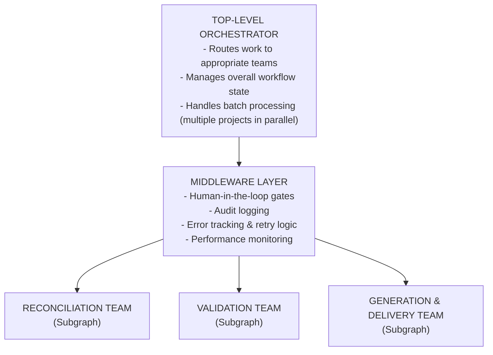
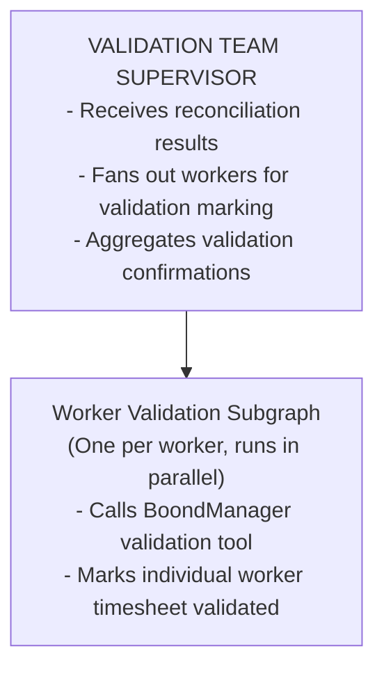
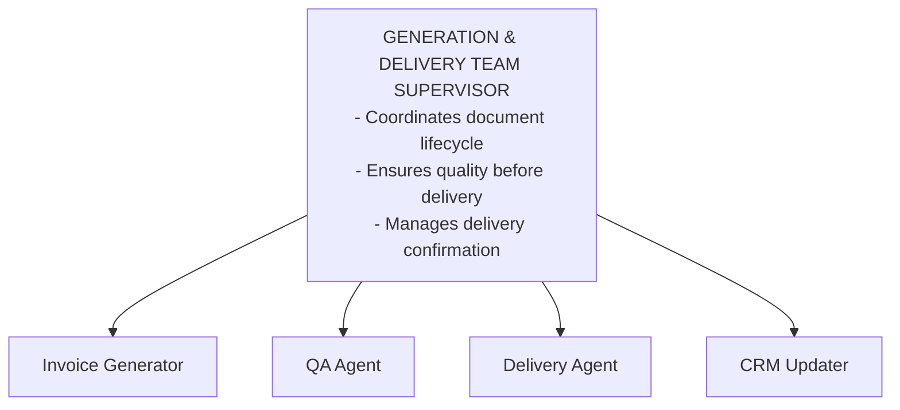
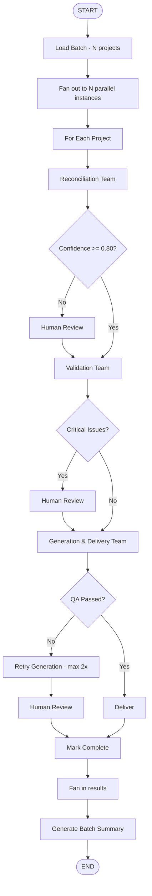
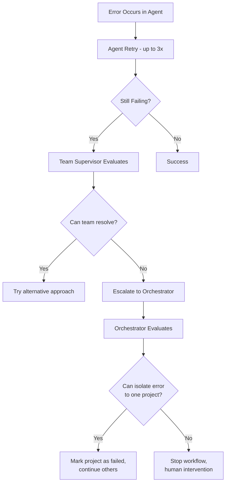

# Invoice Automation - Hierarchical Multi-Agent Architecture

## Architecture Overview

**Pattern**: Hierarchical Team Architecture + Middleware Layers

**Core Concept**: Organize agents into specialized teams, each with their own supervisor. A top-level orchestrator coordinates between teams. Middleware provides cross-cutting concerns (logging, approvals, error handling).

---

## System Architecture Diagram



---

## Team 1: Reconciliation Team

**Purpose**: Cross-check external time-tracking data against BoondManager records

**⚠️ IMPORTANT**: The Reconciliation Team has been completely redesigned to handle the complexity of reconciling 50+ workers with heavy API cross-referencing and per-worker state management.

**See detailed design**: [RECONCILIATION_TEAM_DESIGN.md](./RECONCILIATION_TEAM_DESIGN.md)

### High-Level Summary

The Reconciliation Team uses a **map-reduce pattern** with worker-level subgraphs:

**Phase 1: Project Setup**
- Parse external data (provided as input)
- Query BoondManager for project metadata
- Cross-reference worker lists between systems
- Create master worker list for reconciliation

**Phase 2: Worker Fan-Out (Send API)**
- Each worker gets their own dedicated subgraph
- All workers processed in parallel (e.g., 50 workers = 50 parallel subgraphs)
- Each subgraph manages ~10 variables of worker-specific state
- Performs multi-step reconciliation with cross-referencing
- Returns clean worker result with confidence score

**Phase 3: Aggregation**
- Collect all worker results
- Calculate project-level confidence score
- Detect patterns in discrepancies (systematic vs random)
- Generate summary and recommendation

### Why This Design

**Handles complexity**: Each worker subgraph only tracks 10 variables for one worker, not 500 variables for 50 workers

**Handles scale**: 50 workers = 50 parallel instances, ~10x faster than sequential

**Handles errors**: Worker 23 fails → doesn't block the other 49 workers

**Handles cross-referencing**: Each subgraph can make multiple BoondManager API calls without losing state

### Team Output
- Project-level confidence score (0.0-1.0)
- Per-worker reconciliation results (confidence, status, discrepancies)
- Pattern analysis (systematic issues vs random discrepancies)
- Recommendation (proceed/review/reject)
- Human-readable summary

---

## Team 2: Validation Team

**Purpose**: Mark timesheets as validated in BoondManager after successful reconciliation

**Note**: This is a straightforward step - one tool call per worker to set their timesheet validation status.

### Team Structure (Subgraph)



### Process

Similar to reconciliation, use **map-reduce pattern** with worker-level validation:

**Phase 1: Fan-Out**
- For each worker from reconciliation results
- Send to worker validation subgraph (all in parallel)

**Phase 2: Worker Validation (Per Worker Subgraph)**
- **Input**:
  - Timesheet ID
  - Worker ID
  - Project ID
  - Project name
- **Action**: Call BoondManager tool to mark this worker's timesheet as validated
- **Output**: Validation confirmation for this worker

**Phase 3: Aggregation**
- Collect all worker validation confirmations
- Verify all workers successfully validated
- Generate summary

### Team Supervisor Decision Logic

```
All workers validated successfully → Proceed to Generation Team
Any validation failures → Retry failed workers (up to 3x)
Persistent failures → Escalate to human
```

### Team Output
- List of validated worker timesheets
- Success/failure status per worker
- Overall validation status (all validated / partial / failed)
- Any error messages for failed validations

---

## Team 3: Generation & Delivery Team

**Purpose**: Generate invoices, perform QA, and deliver to clients

### Team Structure (Subgraph)



### Agents in Team

**1. Invoice Generator Agent**
- **Input**: Validated project data, worker breakdown, rates
- **Action**:
  - Populate invoice template with validated data
  - Generate PDF document
  - Create invoice ID
  - Upload to document storage
- **Tools**: Invoice template engine, PDF library, storage API
- **Output**: Invoice PDF URL, invoice metadata

**2. QA Agent**
- **Input**: Generated invoice PDF
- **Action**:
  - Extract data from PDF (OCR/parsing)
  - Verify amounts match input data
  - Check client information accuracy
  - Verify formatting and completeness
  - Visual quality check (no corrupted elements)
- **Tools**: PDF parser, data extraction, LLM for visual QA
- **Output**: QA score (0.0-1.0), issue list

**3. Delivery Agent**
- **Input**: Approved invoice, client contact info
- **Action**:
  - Compose delivery email with invoice attached
  - Send via email service
  - Log delivery confirmation
  - Handle delivery failures with retry
- **Tools**: Email service API, notification system
- **Output**: Delivery confirmation, tracking info

**4. CRM Updater Agent**
- **Input**: Invoice metadata, delivery status
- **Action**:
  - Mark invoice as "sent" in BoondManager
  - Update project billing status
  - Log invoice in client account history
  - Trigger any post-delivery workflows
- **Tools**: BoondManager API client
- **Output**: CRM update confirmation

### Team Supervisor Decision Logic

```
QA Score >= 0.95 → Auto-approve, deliver
QA Score 0.85-0.94 → Flag for review, hold delivery
QA Score < 0.85 → Regenerate invoice, investigate issue

Delivery Success → Update CRM, mark complete
Delivery Failure (3 retries) → Escalate to human
```

### Team Output
- Invoice ID and URL
- QA report
- Delivery confirmation
- CRM update status

---

## Top-Level Orchestrator

**Purpose**: Coordinate all teams and manage overall workflow

### Responsibilities

**1. Workflow State Management**
- Track which projects are in which stage
- Maintain global workflow state
- Coordinate checkpointing for resumability

**2. Team Routing**
- Route projects to Reconciliation Team first
- Based on team output, decide next step
- Handle parallel processing of multiple projects

**3. Error Coordination**
- Collect errors from all teams
- Decide retry strategy
- Escalate to human when appropriate

**4. Batch Processing**
- Process multiple projects in parallel using Send API
- Aggregate results across all projects
- Generate summary reports

### Routing Logic



---

## Middleware Layers

### 1. Human-in-the-Loop Middleware

**Applied**: Before/after each team execution

**Hooks**:
- `before_team`: Check if human approval required based on confidence thresholds
- `after_team`: Present results for optional human review
- `on_interrupt`: Pause workflow, save state, await resume command

**Approval Gates**:
- Reconciliation confidence < threshold → interrupt()
- Validation critical errors → interrupt()
- QA score < threshold → interrupt()
- First-time client → interrupt() before delivery

### 2. Audit & Logging Middleware

**Applied**: Wraps all agents and teams

**Captures**:
- Input/output of every agent
- Decisions made by supervisors
- LLM calls and responses
- API calls to external systems
- Timestamps for performance tracking

**Sends to**:
- LangSmith for tracing
- Structured logs (JSON format)
- Monitoring dashboard

### 3. Error Handling Middleware

**Applied**: Around all agent executions

**Handles**:
- Transient errors (API timeouts) → Auto-retry with backoff
- Data errors (validation failures) → Route to appropriate team supervisor
- Critical errors → Escalate to top-level orchestrator
- Unrecoverable errors → Human escalation

**Retry Policies**:
- API calls: 3 retries, exponential backoff
- LLM calls: 2 retries with temperature adjustment
- Document generation: 2 retries, then human review

### 4. Performance Monitoring Middleware

**Tracks**:
- Execution time per agent
- Token usage per LLM call
- API call latency
- Success/failure rates
- Cost per invoice processed

**Alerts**:
- Execution time > threshold
- Error rate spike
- Cost exceeds budget
- Approval queue buildup

---

## Communication Patterns

### Team-to-Team Communication

**Pattern**: Shared state schema with team-specific outputs

Each team writes to shared state:
- Reconciliation team → `reconciliation_result` key
- Validation team → `validation_result` key
- Generation team → `invoice_metadata` key

Top-level orchestrator reads all team outputs to make routing decisions.

### Agent-to-Agent Within Team

**Pattern**: Team supervisor coordinates, agents don't communicate directly

- Agents only communicate with team supervisor
- Supervisor manages execution order
- Supervisor aggregates results
- Clean separation of concerns

### Parent-to-Subgraph

**Pattern**: State transformation at boundaries

Top-level orchestrator:
- Extracts project-specific data
- Passes to team subgraph
- Receives team result
- Merges back into global state

---

## Scalability Strategy

### Parallel Processing

**Batch Level**:
- Process N invoices in parallel (Send API)
- Each invoice gets independent workflow instance
- Results aggregated at end

**Team Level**:
- Some agents within teams can run in parallel
- Example: In Validation Team, all 3 validators run simultaneously
- Aggregator waits for all (deferred execution)

### Checkpointing

**Persistence**: PostgreSQL checkpointer

**Checkpoints Created**:
- After each team completes
- Before each human-in-the-loop gate
- After errors (for retry)
- At workflow completion

**Benefits**:
- Resume after interruption
- Audit trail of all decisions
- Debug failed workflows
- Support multi-day processing for large batches

---

## Error Recovery Strategy

### Error Classification

**Level 1: Agent Error**
- Handled by agent's retry policy
- If persistent → escalate to team supervisor

**Level 2: Team Error**
- Team supervisor attempts resolution
- May retry with different parameters
- If unresolvable → escalate to top-level orchestrator

**Level 3: Workflow Error**
- Top-level orchestrator evaluates
- Checks if other projects can continue
- Decides: skip project, retry later, or human escalation

### Recovery Paths



---

## Human-in-the-Loop Integration

### Approval Interface

**When Triggered**:
- Confidence thresholds not met
- Critical validation errors
- QA failures
- Manual review mode enabled

**What Human Sees**:
- Context: Which project, which stage
- Issue summary: What went wrong
- Supporting data: Discrepancies, errors, relevant documents
- Suggested actions: Approve, reject, edit data, adjust settings

**Human Actions**:
- **Approve**: Resume workflow from interrupt point
- **Reject**: Mark project as failed, provide reason
- **Edit & Retry**: Modify data, restart from failed stage
- **Adjust Thresholds**: Change confidence requirements for this run

### Resume Mechanism

Workflow uses `interrupt()` to pause:
- State is checkpointed
- Human reviews via dashboard
- Human submits decision via `Command(resume=...)`
- Workflow continues from exact interrupt point

---

## Technology Integration Points

### External Systems

**1. BoondManager CRM**
- Authentication: API key
- Operations: Fetch projects, workers, rates; Update invoice status
- Error handling: Rate limiting, retry on 5xx errors

**2. External Time-Tracking System**
- Authentication: OAuth 2.0
- Operations: Fetch time entries for billing period
- Error handling: Data validation, missing timesheet alerts

**3. Email Service**
- Provider: SendGrid / AWS SES
- Operations: Send invoices with attachments
- Error handling: Bounce handling, retry failed sends

**4. Document Storage**
- Provider: AWS S3 / Google Cloud Storage
- Operations: Upload invoices, generate signed URLs
- Error handling: Redundant storage, corruption checks

### Internal Services

**1. PostgreSQL Database**
- Workflow checkpoints
- Audit logs
- Invoice metadata

**2. LangSmith**
- LLM call tracing
- Performance analytics
- Debugging workflows

**3. Monitoring Dashboard**
- Real-time workflow status
- Error alerts
- Approval queue

---

## Next Steps

### Step 1: Validate Architecture
**Question for you**: Does this hierarchical team structure make sense for your workflow? Any teams that seem over/under-engineered?

### Step 2: State Schema Design
Once architecture is confirmed, design the state schema that flows between teams.

### Step 3: Pick First Team to Build
Recommendation: Start with Reconciliation Team as it's first in workflow and has clearest inputs/outputs.

### Step 4: Integration Planning
Map out exact API endpoints and authentication for BoondManager and time-tracking system.

Ready to proceed, or want to adjust the architecture?
