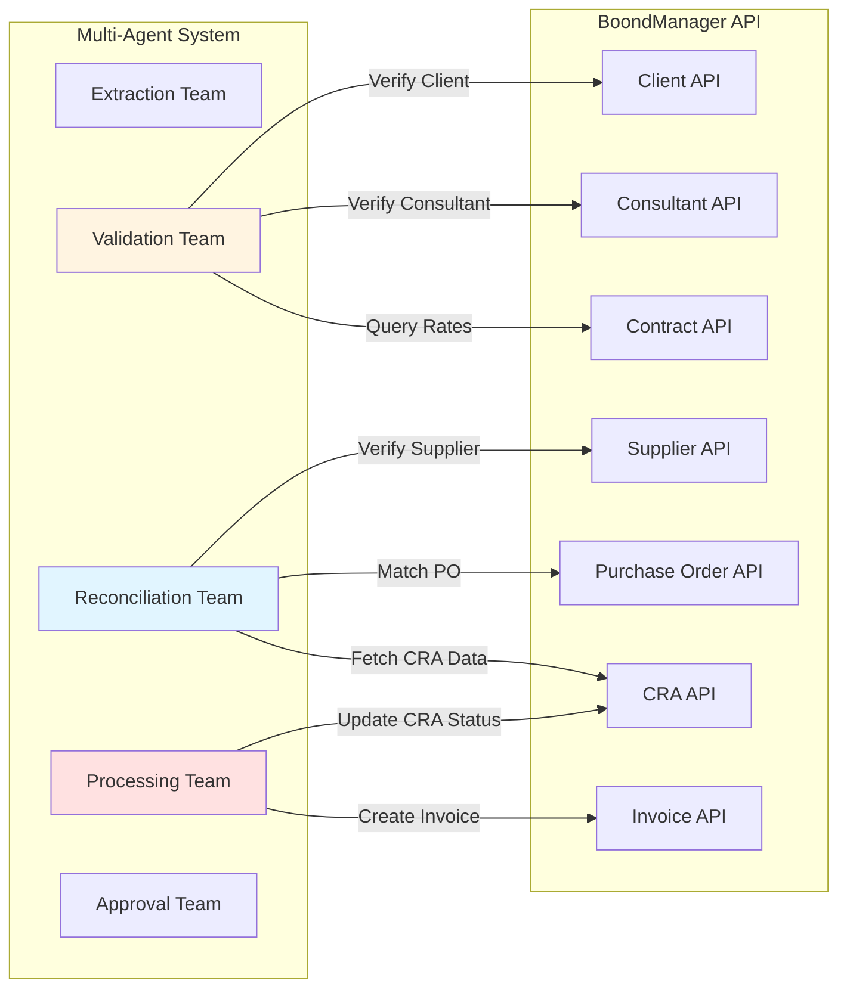
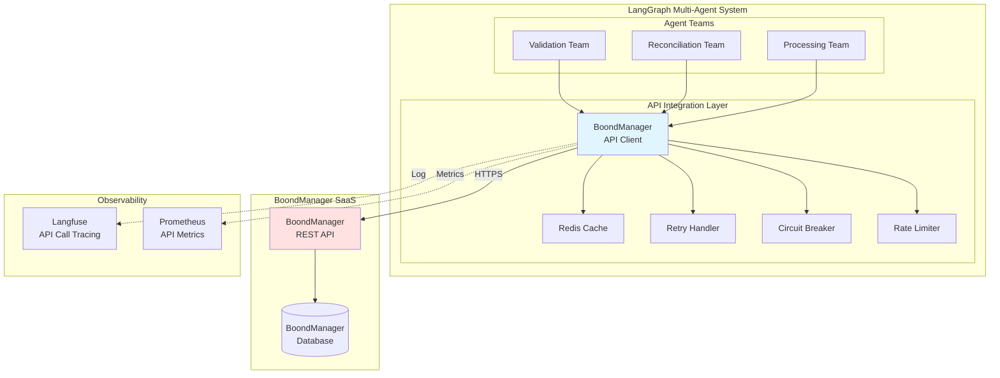
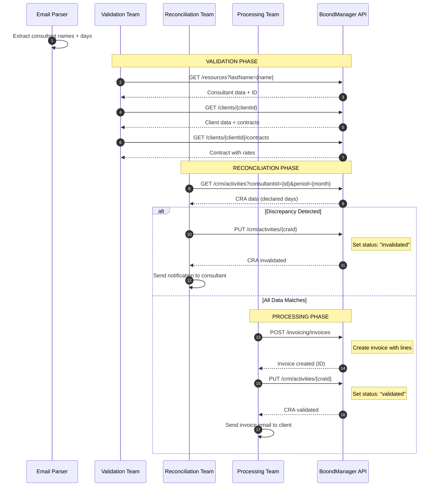
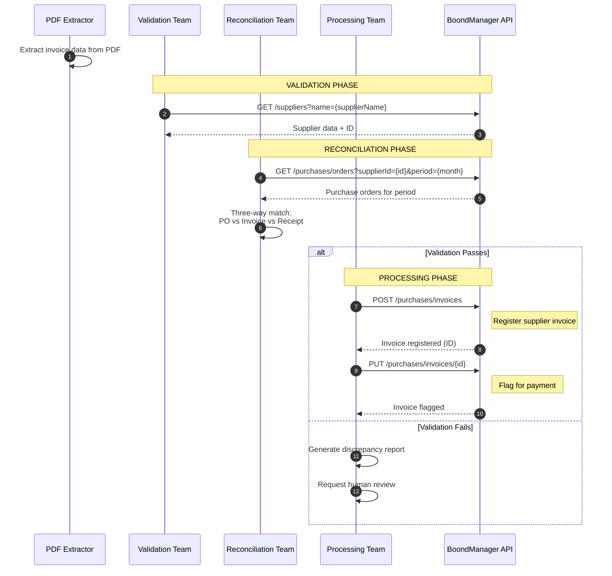
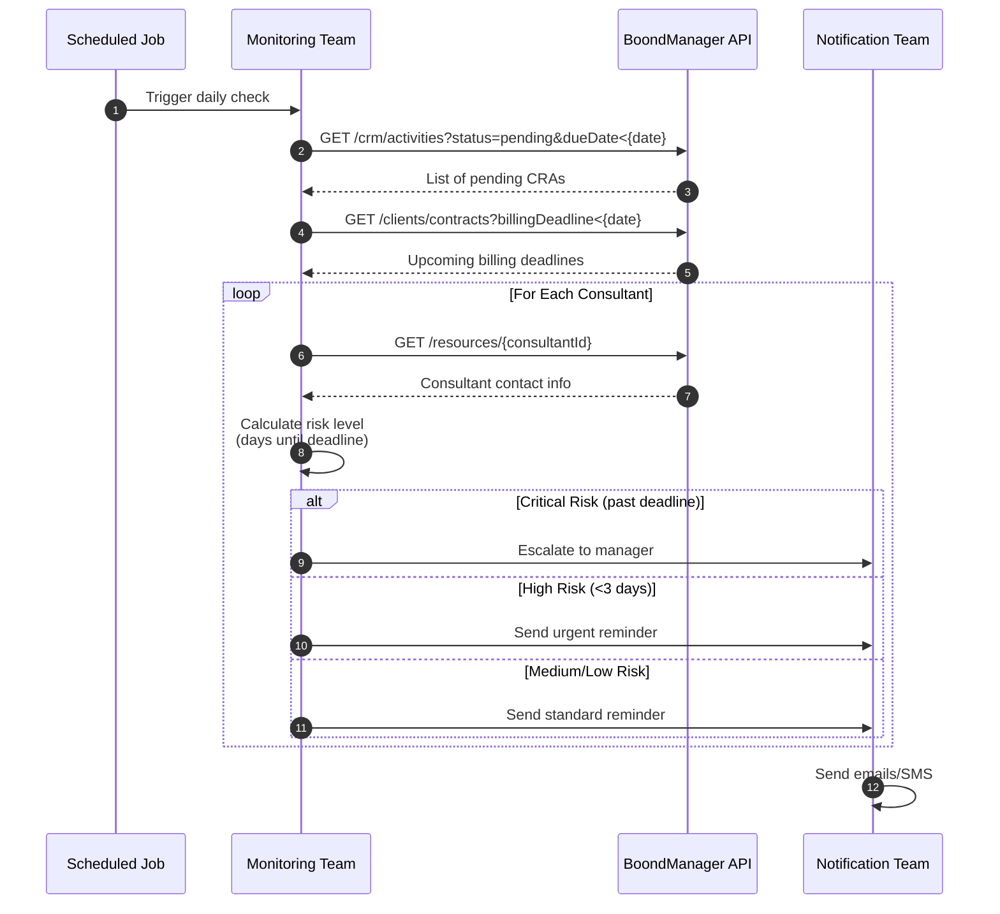
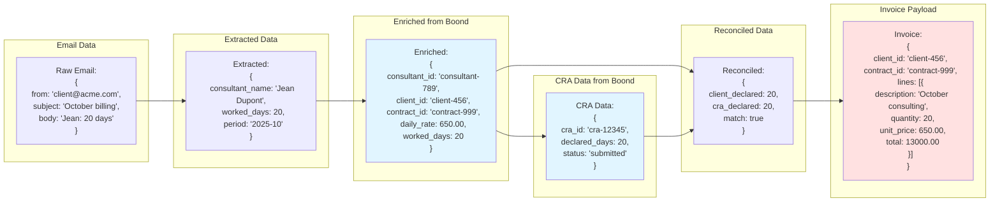
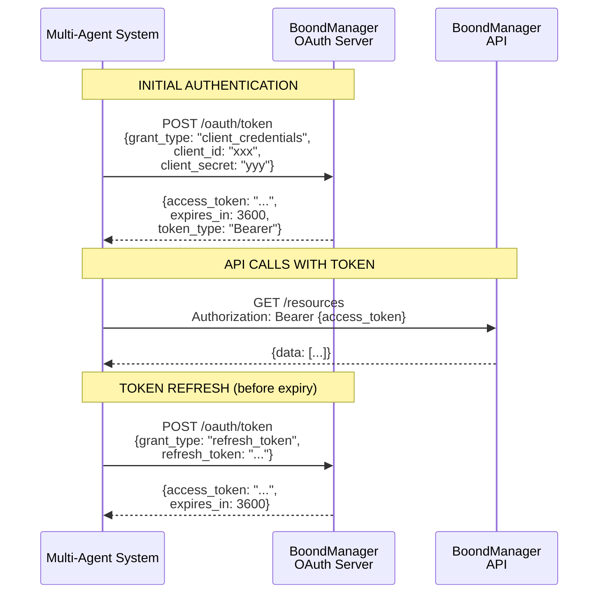
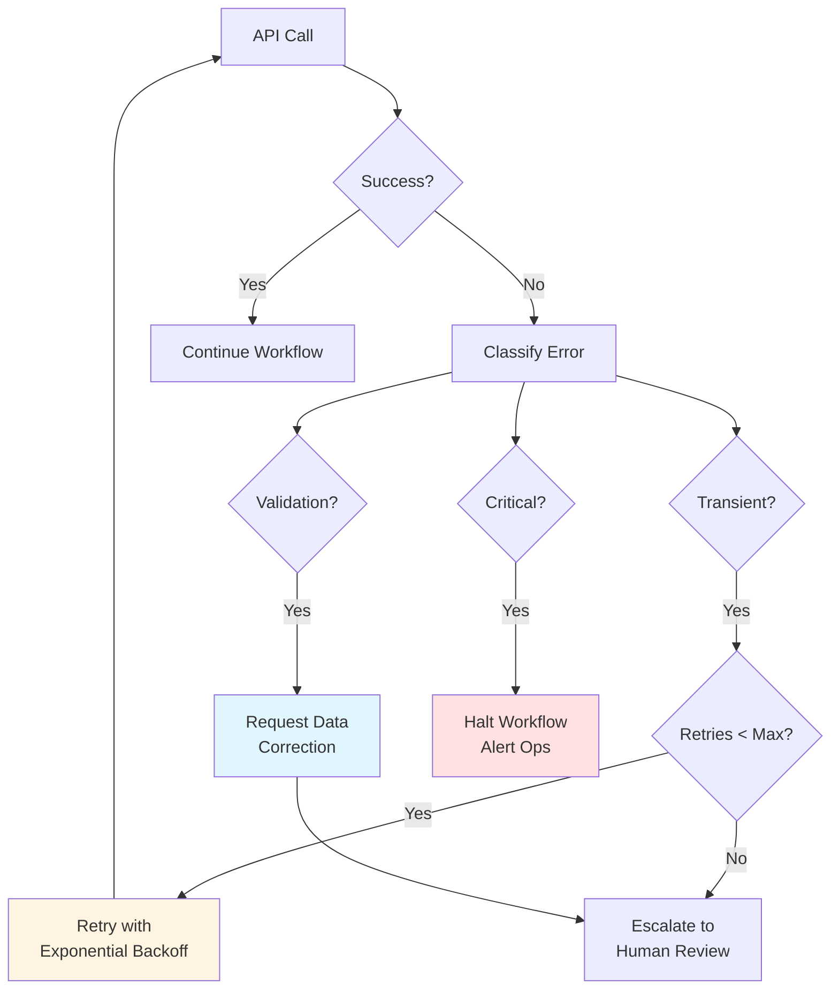

# BoondManager API Integration - Technical & Functional Specification

## Table of Contents
1. [Overview](#1-overview)
2. [BoondManager Context](#2-boondmanager-context)
3. [Integration Architecture](#3-integration-architecture)
4. [API Operations Mapping](#4-api-operations-mapping)
5. [Data Flow Diagrams](#5-data-flow-diagrams)
6. [Technical Implementation](#6-technical-implementation)
7. [Authentication & Security](#7-authentication--security)
8. [Error Handling & Resilience](#8-error-handling--resilience)
9. [Performance & Optimization](#9-performance--optimization)
10. [Testing Strategy](#10-testing-strategy)

---

## 1. Overview

### 1.1 What is BoondManager?

**BoondManager** is a specialized ERP/CRM solution designed for **ESN (Entreprise de Services du Numérique)** - IT consulting and services companies. It manages the entire lifecycle of consulting operations:

- **Consultant Management**: Skills, availability, assignments
- **Client Relationship Management**: Opportunities, contracts, interactions
- **Project Management**: Missions, staffing, planning
- **Activity Reporting (CRA)**: Time tracking, worked days validation
- **Billing & Invoicing**: Invoice generation, payment tracking
- **Financial Management**: Revenues, costs, margins, budgets
- **Purchase Management**: Supplier contracts, purchase orders, supplier invoices

### 1.2 Role in Financial Workflows

BoondManager serves as the **single source of truth** for:
- ✅ Consultant activity reports (CRA - Compte Rendu d'Activité)
- ✅ Client contracts and billing rates
- ✅ Supplier contracts and purchase orders
- ✅ Invoice generation and tracking
- ✅ Financial ledger and accounting entries

Our multi-agent system **integrates deeply** with BoondManager to:
1. **Query** consultant activity data for reconciliation
2. **Validate** against contracts, rates, and purchase orders
3. **Create** invoices and financial entries
4. **Update** activity report statuses (validate/invalidate)
5. **Track** payment statuses and financial positions

### 1.3 Integration Scope



---

## 2. BoondManager Context

### 2.1 Key Entities in BoondManager

#### **CRA (Compte Rendu d'Activité)**
Activity report submitted by consultants declaring worked days per client/project.

**Structure**:
```json
{
  "id": "cra-12345",
  "consultant": {
    "id": "consultant-789",
    "firstName": "Jean",
    "lastName": "Dupont"
  },
  "resource": {
    "id": "resource-456",
    "label": "Mission ClientX"
  },
  "period": {
    "startDate": "2025-10-01",
    "endDate": "2025-10-31"
  },
  "activities": [
    {
      "date": "2025-10-01",
      "duration": 1.0,
      "typeCode": "production",
      "comment": "Development"
    }
  ],
  "totalDays": 20.0,
  "status": "submitted",
  "validationDate": null,
  "validator": null
}
```

**States**: `draft` → `submitted` → `validated` / `rejected` / `invalidated`

#### **Consultant (Resource)**
Individual consultant with skills, contracts, and availability.

**Structure**:
```json
{
  "id": "consultant-789",
  "typeResource": "employee",
  "firstName": "Jean",
  "lastName": "Dupont",
  "email": "jean.dupont@company.fr",
  "mainContract": {
    "id": "contract-123",
    "startDate": "2023-01-01",
    "endDate": null,
    "status": "active"
  },
  "skills": ["Java", "Python", "AWS"],
  "availability": "available"
}
```

#### **Client**
Organization purchasing consulting services.

**Structure**:
```json
{
  "id": "client-456",
  "reference": "CLI-001",
  "name": "ACME Corporation",
  "billingAddress": {...},
  "contacts": [...],
  "contracts": [...]
}
```

#### **Contract**
Agreement between ESN and client defining rates, terms, and scope.

**Structure**:
```json
{
  "id": "contract-999",
  "client": {"id": "client-456"},
  "reference": "CONT-2025-001",
  "startDate": "2025-01-01",
  "endDate": "2025-12-31",
  "rates": [
    {
      "profile": "Senior Developer",
      "dailyRate": 650.00,
      "currency": "EUR"
    }
  ],
  "billingFrequency": "monthly",
  "paymentTerms": "30 days"
}
```

#### **Invoice**
Client-facing invoice for services rendered.

**Structure**:
```json
{
  "id": "invoice-777",
  "reference": "INV-2025-10-001",
  "client": {"id": "client-456"},
  "contract": {"id": "contract-999"},
  "issueDate": "2025-11-01",
  "dueDate": "2025-12-01",
  "lines": [
    {
      "description": "Consulting - October 2025",
      "quantity": 20.0,
      "unitPrice": 650.00,
      "totalExclTax": 13000.00
    }
  ],
  "totalExclTax": 13000.00,
  "totalTax": 2600.00,
  "totalInclTax": 15600.00,
  "status": "draft",
  "paidAmount": 0.00
}
```

#### **Purchase Order (PO)**
Agreement with supplier for purchased services (e.g., subcontracting).

**Structure**:
```json
{
  "id": "po-888",
  "reference": "PO-2025-050",
  "supplier": {"id": "supplier-321"},
  "startDate": "2025-10-01",
  "endDate": "2025-10-31",
  "lines": [
    {
      "consultant": "John Smith",
      "dailyRate": 450.00,
      "estimatedDays": 20.0
    }
  ],
  "totalAmount": 9000.00,
  "status": "approved"
}
```

### 2.2 BoondManager API Capabilities

**Base URL**: `https://api.boondmanager.com/api/v3`

**Authentication**: OAuth 2.0 Bearer Token

**Rate Limits**:
- 100 requests/minute per API key
- Burst: 20 requests/second

**API Categories**:
1. **CRA Management** - `/crm/activities`, `/crm/activities/{id}`
2. **Resources** - `/resources`, `/resources/{id}`
3. **Clients** - `/clients`, `/clients/{id}`
4. **Contracts** - `/clients/{clientId}/contracts`
5. **Invoicing** - `/invoicing/invoices`, `/invoicing/invoices/{id}`
6. **Purchases** - `/purchases/orders`, `/purchases/invoices`
7. **Suppliers** - `/suppliers`, `/suppliers/{id}`

---

## 3. Integration Architecture

### 3.1 High-Level Integration Pattern



### 3.2 Integration Layers

#### **Layer 1: Low-Level HTTP Client**
- Raw HTTP requests/responses
- Connection pooling (httpx.AsyncClient)
- TLS 1.3 encryption
- Timeout management

#### **Layer 2: API Client Wrapper**
- BoondManager-specific client
- Request/response serialization (Pydantic)
- Authentication token management
- Error parsing and classification

#### **Layer 3: Resilience Layer**
- Retry with exponential backoff
- Circuit breaker (fail-fast after sustained errors)
- Rate limiting (respect API limits)
- Request queueing

#### **Layer 4: Caching Layer**
- Redis-based caching
- Cache invalidation strategies
- TTL management per resource type

#### **Layer 5: Business Logic Layer**
- Agent-specific API operations
- Data transformation
- Validation logic
- State management

---

## 4. API Operations Mapping

### 4.1 Client Billing Workflow - API Calls



**API Calls Summary**:
1. `GET /resources?lastName={name}` - Lookup consultant by name
2. `GET /clients/{clientId}` - Verify client exists
3. `GET /clients/{clientId}/contracts` - Get billing rates
4. `GET /crm/activities?consultantId={id}&period={month}` - Fetch CRA data
5. `PUT /crm/activities/{craId}` - Update CRA status (validate/invalidate)
6. `POST /invoicing/invoices` - Create invoice

### 4.2 Supplier Invoice Workflow - API Calls



**API Calls Summary**:
1. `GET /suppliers?name={supplierName}` - Lookup supplier
2. `GET /purchases/orders?supplierId={id}&period={month}` - Fetch purchase orders
3. `POST /purchases/invoices` - Register supplier invoice
4. `PUT /purchases/invoices/{id}` - Update invoice status

### 4.3 Activity Monitoring Workflow - API Calls



**API Calls Summary**:
1. `GET /crm/activities?status=pending&dueDate<{date}` - Pending CRAs
2. `GET /clients/contracts?billingDeadline<{date}` - Upcoming deadlines
3. `GET /resources/{consultantId}` - Consultant contact info

---

## 5. Data Flow Diagrams

### 5.1 Data Flow: Client Billing

```mermaid
graph TB
    START([Client Email Received])

    EXTRACT[Extract:<br/>Consultant names<br/>Worked days<br/>Period]

    LOOKUP_CONSULTANT[API: Lookup Consultant<br/>GET /resources]
    LOOKUP_CLIENT[API: Get Client<br/>GET /clients/{id}]
    LOOKUP_CONTRACT[API: Get Contract & Rates<br/>GET /clients/{id}/contracts]

    FETCH_CRA[API: Fetch CRA Data<br/>GET /crm/activities]

    COMPARE{Compare:<br/>Email days<br/>vs CRA days}

    INVALIDATE[API: Invalidate CRA<br/>PUT /crm/activities/{id}<br/>status=invalidated]

    NOTIFY_CONSULTANT[Send Email:<br/>Discrepancy details<br/>to consultant]

    CREATE_INVOICE[API: Create Invoice<br/>POST /invoicing/invoices]

    VALIDATE_CRA[API: Validate CRA<br/>PUT /crm/activities/{id}<br/>status=validated]

    SEND_INVOICE[Send Email:<br/>Invoice to client]

    END([Workflow Complete])

    START --> EXTRACT
    EXTRACT --> LOOKUP_CONSULTANT
    LOOKUP_CONSULTANT --> LOOKUP_CLIENT
    LOOKUP_CLIENT --> LOOKUP_CONTRACT
    LOOKUP_CONTRACT --> FETCH_CRA

    FETCH_CRA --> COMPARE

    COMPARE -->|Mismatch| INVALIDATE
    INVALIDATE --> NOTIFY_CONSULTANT
    NOTIFY_CONSULTANT --> END

    COMPARE -->|Match| CREATE_INVOICE
    CREATE_INVOICE --> VALIDATE_CRA
    VALIDATE_CRA --> SEND_INVOICE
    SEND_INVOICE --> END

    style LOOKUP_CONSULTANT fill:#e1f5ff
    style LOOKUP_CLIENT fill:#e1f5ff
    style LOOKUP_CONTRACT fill:#e1f5ff
    style FETCH_CRA fill:#e1f5ff
    style INVALIDATE fill:#ffe1e1
    style CREATE_INVOICE fill:#ffe1e1
    style VALIDATE_CRA fill:#ffe1e1
```

### 5.2 Data Transformation Pipeline



---

## 6. Technical Implementation

### 6.1 BoondManager API Client (Python)

```python
import httpx
from typing import Optional, List, Dict, Any
from pydantic import BaseModel
from decimal import Decimal
from datetime import datetime, date
import asyncio
from functools import wraps
import logging

# ============================================================================
# DATA MODELS
# ============================================================================

class BoondConsultant(BaseModel):
    id: str
    firstName: str
    lastName: str
    email: str
    typeResource: str

class BoondClient(BaseModel):
    id: str
    reference: str
    name: str

class BoondContract(BaseModel):
    id: str
    client_id: str
    reference: str
    startDate: date
    endDate: Optional[date]
    rates: List[Dict[str, Any]]

class BoondCRA(BaseModel):
    id: str
    consultant_id: str
    period_start: date
    period_end: date
    total_days: Decimal
    status: str
    activities: List[Dict[str, Any]]

class BoondInvoice(BaseModel):
    id: Optional[str] = None
    reference: Optional[str] = None
    client_id: str
    contract_id: str
    issue_date: date
    due_date: date
    lines: List[Dict[str, Any]]
    total_excl_tax: Decimal
    total_tax: Decimal
    total_incl_tax: Decimal
    status: str = "draft"

class BoondPurchaseOrder(BaseModel):
    id: str
    reference: str
    supplier_id: str
    start_date: date
    end_date: date
    lines: List[Dict[str, Any]]
    total_amount: Decimal
    status: str

# ============================================================================
# EXCEPTIONS
# ============================================================================

class BoondAPIError(Exception):
    """Base exception for Boond API errors"""
    pass

class BoondAuthenticationError(BoondAPIError):
    """Authentication failed"""
    pass

class BoondRateLimitError(BoondAPIError):
    """Rate limit exceeded"""
    pass

class BoondResourceNotFoundError(BoondAPIError):
    """Resource not found (404)"""
    pass

class BoondValidationError(BoondAPIError):
    """Request validation failed (400)"""
    pass

# ============================================================================
# RETRY DECORATOR
# ============================================================================

def retry_with_backoff(max_retries: int = 3, base_delay: float = 1.0):
    """Retry decorator with exponential backoff"""
    def decorator(func):
        @wraps(func)
        async def wrapper(*args, **kwargs):
            for attempt in range(max_retries):
                try:
                    return await func(*args, **kwargs)
                except (httpx.TimeoutException, httpx.NetworkError) as e:
                    if attempt == max_retries - 1:
                        raise BoondAPIError(f"Max retries exceeded: {e}")

                    delay = base_delay * (2 ** attempt)
                    logging.warning(f"Retry {attempt + 1}/{max_retries} after {delay}s: {e}")
                    await asyncio.sleep(delay)
                except BoondRateLimitError as e:
                    if attempt == max_retries - 1:
                        raise

                    # Rate limit - wait longer
                    delay = 60.0  # 1 minute
                    logging.warning(f"Rate limit hit, waiting {delay}s")
                    await asyncio.sleep(delay)
                except Exception as e:
                    # Don't retry on other errors
                    raise
        return wrapper
    return decorator

# ============================================================================
# CIRCUIT BREAKER
# ============================================================================

class CircuitBreaker:
    """Circuit breaker pattern for API resilience"""

    def __init__(self, failure_threshold: int = 5, recovery_timeout: float = 60.0):
        self.failure_threshold = failure_threshold
        self.recovery_timeout = recovery_timeout
        self.failure_count = 0
        self.last_failure_time: Optional[datetime] = None
        self.state = "closed"  # closed, open, half-open

    async def call(self, func, *args, **kwargs):
        if self.state == "open":
            if datetime.utcnow().timestamp() - self.last_failure_time.timestamp() > self.recovery_timeout:
                self.state = "half-open"
                logging.info("Circuit breaker: half-open, attempting recovery")
            else:
                raise BoondAPIError("Circuit breaker is OPEN - service unavailable")

        try:
            result = await func(*args, **kwargs)

            if self.state == "half-open":
                self.state = "closed"
                self.failure_count = 0
                logging.info("Circuit breaker: closed, service recovered")

            return result
        except Exception as e:
            self.failure_count += 1
            self.last_failure_time = datetime.utcnow()

            if self.failure_count >= self.failure_threshold:
                self.state = "open"
                logging.error(f"Circuit breaker: OPEN after {self.failure_count} failures")

            raise

# ============================================================================
# RATE LIMITER
# ============================================================================

class RateLimiter:
    """Token bucket rate limiter"""

    def __init__(self, max_requests: int = 100, time_window: float = 60.0):
        self.max_requests = max_requests
        self.time_window = time_window
        self.tokens = max_requests
        self.last_refill = datetime.utcnow()

    async def acquire(self):
        """Acquire a token, waiting if necessary"""
        now = datetime.utcnow()
        elapsed = (now - self.last_refill).total_seconds()

        # Refill tokens based on elapsed time
        self.tokens = min(
            self.max_requests,
            self.tokens + (elapsed / self.time_window) * self.max_requests
        )
        self.last_refill = now

        if self.tokens >= 1:
            self.tokens -= 1
            return

        # Wait until token available
        wait_time = (1 - self.tokens) * (self.time_window / self.max_requests)
        logging.warning(f"Rate limit: waiting {wait_time:.2f}s")
        await asyncio.sleep(wait_time)
        self.tokens = 0

# ============================================================================
# BOONDMANAGER API CLIENT
# ============================================================================

class BoondManagerClient:
    """Async client for BoondManager API with resilience features"""

    def __init__(
        self,
        base_url: str = "https://api.boondmanager.com/api/v3",
        api_key: str = None,
        access_token: str = None,
        timeout: float = 30.0,
        max_retries: int = 3,
        cache_ttl: int = 300,  # 5 minutes
        redis_client = None
    ):
        self.base_url = base_url
        self.api_key = api_key
        self.access_token = access_token
        self.timeout = timeout
        self.max_retries = max_retries
        self.cache_ttl = cache_ttl
        self.redis_client = redis_client

        # Resilience components
        self.circuit_breaker = CircuitBreaker()
        self.rate_limiter = RateLimiter(max_requests=100, time_window=60.0)

        # HTTP client with connection pooling
        self.client = httpx.AsyncClient(
            base_url=base_url,
            timeout=timeout,
            limits=httpx.Limits(max_keepalive_connections=20, max_connections=100)
        )

    def _get_headers(self) -> Dict[str, str]:
        """Get request headers with authentication"""
        headers = {
            "Content-Type": "application/json",
            "Accept": "application/json"
        }

        if self.access_token:
            headers["Authorization"] = f"Bearer {self.access_token}"
        elif self.api_key:
            headers["X-API-Key"] = self.api_key

        return headers

    def _handle_response(self, response: httpx.Response) -> Dict[str, Any]:
        """Handle API response and raise appropriate exceptions"""
        if response.status_code == 200 or response.status_code == 201:
            return response.json()
        elif response.status_code == 401:
            raise BoondAuthenticationError("Authentication failed")
        elif response.status_code == 404:
            raise BoondResourceNotFoundError("Resource not found")
        elif response.status_code == 400:
            raise BoondValidationError(f"Validation error: {response.text}")
        elif response.status_code == 429:
            raise BoondRateLimitError("Rate limit exceeded")
        else:
            raise BoondAPIError(f"API error {response.status_code}: {response.text}")

    async def _get_cached(self, cache_key: str) -> Optional[Dict[str, Any]]:
        """Get data from cache if available"""
        if not self.redis_client:
            return None

        try:
            cached = await self.redis_client.get(cache_key)
            if cached:
                return json.loads(cached)
        except Exception as e:
            logging.warning(f"Cache read error: {e}")

        return None

    async def _set_cache(self, cache_key: str, data: Dict[str, Any]):
        """Set data in cache"""
        if not self.redis_client:
            return

        try:
            await self.redis_client.setex(
                cache_key,
                self.cache_ttl,
                json.dumps(data)
            )
        except Exception as e:
            logging.warning(f"Cache write error: {e}")

    @retry_with_backoff(max_retries=3, base_delay=1.0)
    async def _request(
        self,
        method: str,
        endpoint: str,
        params: Optional[Dict[str, Any]] = None,
        data: Optional[Dict[str, Any]] = None,
        use_cache: bool = False
    ) -> Dict[str, Any]:
        """Make API request with resilience features"""

        # Rate limiting
        await self.rate_limiter.acquire()

        # Check cache for GET requests
        if method == "GET" and use_cache:
            cache_key = f"boond:{endpoint}:{str(params)}"
            cached = await self._get_cached(cache_key)
            if cached:
                logging.debug(f"Cache hit: {cache_key}")
                return cached

        # Make request through circuit breaker
        async def make_request():
            response = await self.client.request(
                method=method,
                url=endpoint,
                headers=self._get_headers(),
                params=params,
                json=data
            )
            return self._handle_response(response)

        result = await self.circuit_breaker.call(make_request)

        # Cache successful GET requests
        if method == "GET" and use_cache:
            cache_key = f"boond:{endpoint}:{str(params)}"
            await self._set_cache(cache_key, result)

        return result

    # ========================================================================
    # CONSULTANT / RESOURCE API
    # ========================================================================

    async def get_consultant_by_name(
        self,
        first_name: str,
        last_name: str
    ) -> Optional[BoondConsultant]:
        """Find consultant by name"""

        params = {
            "firstName": first_name,
            "lastName": last_name
        }

        result = await self._request(
            "GET",
            "/resources",
            params=params,
            use_cache=True
        )

        if result.get("data") and len(result["data"]) > 0:
            return BoondConsultant(**result["data"][0])

        return None

    async def get_consultant_by_id(self, consultant_id: str) -> BoondConsultant:
        """Get consultant details by ID"""

        result = await self._request(
            "GET",
            f"/resources/{consultant_id}",
            use_cache=True
        )

        return BoondConsultant(**result["data"])

    # ========================================================================
    # CLIENT API
    # ========================================================================

    async def get_client_by_id(self, client_id: str) -> BoondClient:
        """Get client details"""

        result = await self._request(
            "GET",
            f"/clients/{client_id}",
            use_cache=True
        )

        return BoondClient(**result["data"])

    async def get_client_contracts(
        self,
        client_id: str,
        active_only: bool = True
    ) -> List[BoondContract]:
        """Get client contracts"""

        params = {}
        if active_only:
            params["status"] = "active"

        result = await self._request(
            "GET",
            f"/clients/{client_id}/contracts",
            params=params,
            use_cache=True
        )

        return [BoondContract(**contract) for contract in result["data"]]

    # ========================================================================
    # CRA (Activity Report) API
    # ========================================================================

    async def get_consultant_cra(
        self,
        consultant_id: str,
        period_start: date,
        period_end: date
    ) -> List[BoondCRA]:
        """Get consultant's activity reports for period"""

        params = {
            "consultantId": consultant_id,
            "startDate": period_start.isoformat(),
            "endDate": period_end.isoformat()
        }

        result = await self._request(
            "GET",
            "/crm/activities",
            params=params,
            use_cache=False  # Don't cache CRA data (changes frequently)
        )

        return [BoondCRA(**cra) for cra in result["data"]]

    async def update_cra_status(
        self,
        cra_id: str,
        status: str,
        validator_id: Optional[str] = None
    ) -> BoondCRA:
        """Update CRA status (validate/invalidate)"""

        data = {
            "status": status
        }

        if validator_id:
            data["validator"] = validator_id
            data["validationDate"] = datetime.utcnow().isoformat()

        result = await self._request(
            "PUT",
            f"/crm/activities/{cra_id}",
            data=data
        )

        return BoondCRA(**result["data"])

    async def validate_cra(self, cra_id: str, validator_id: str) -> BoondCRA:
        """Validate a CRA"""
        return await self.update_cra_status(cra_id, "validated", validator_id)

    async def invalidate_cra(self, cra_id: str) -> BoondCRA:
        """Invalidate a CRA"""
        return await self.update_cra_status(cra_id, "invalidated")

    # ========================================================================
    # INVOICE API
    # ========================================================================

    async def create_invoice(self, invoice: BoondInvoice) -> BoondInvoice:
        """Create a new invoice"""

        data = invoice.dict(exclude_none=True)

        result = await self._request(
            "POST",
            "/invoicing/invoices",
            data=data
        )

        return BoondInvoice(**result["data"])

    async def get_invoice(self, invoice_id: str) -> BoondInvoice:
        """Get invoice by ID"""

        result = await self._request(
            "GET",
            f"/invoicing/invoices/{invoice_id}",
            use_cache=True
        )

        return BoondInvoice(**result["data"])

    # ========================================================================
    # PURCHASE ORDER API
    # ========================================================================

    async def get_purchase_orders(
        self,
        supplier_id: str,
        period_start: Optional[date] = None,
        period_end: Optional[date] = None
    ) -> List[BoondPurchaseOrder]:
        """Get purchase orders for supplier"""

        params = {
            "supplierId": supplier_id
        }

        if period_start:
            params["startDate"] = period_start.isoformat()
        if period_end:
            params["endDate"] = period_end.isoformat()

        result = await self._request(
            "GET",
            "/purchases/orders",
            params=params,
            use_cache=True
        )

        return [BoondPurchaseOrder(**po) for po in result["data"]]

    async def create_supplier_invoice(
        self,
        supplier_id: str,
        purchase_order_id: str,
        invoice_data: Dict[str, Any]
    ) -> Dict[str, Any]:
        """Register supplier invoice"""

        data = {
            "supplierId": supplier_id,
            "purchaseOrderId": purchase_order_id,
            **invoice_data
        }

        result = await self._request(
            "POST",
            "/purchases/invoices",
            data=data
        )

        return result["data"]

    # ========================================================================
    # UTILITY METHODS
    # ========================================================================

    async def close(self):
        """Close HTTP client"""
        await self.client.aclose()

    async def __aenter__(self):
        return self

    async def __aexit__(self, exc_type, exc_val, exc_tb):
        await self.close()

# ============================================================================
# USAGE EXAMPLE
# ============================================================================

async def example_usage():
    """Example usage of BoondManager client"""

    async with BoondManagerClient(
        api_key="your-api-key",
        cache_ttl=300
    ) as client:
        # Lookup consultant
        consultant = await client.get_consultant_by_name("Jean", "Dupont")
        print(f"Found consultant: {consultant.id}")

        # Get CRA data
        from datetime import date
        cras = await client.get_consultant_cra(
            consultant_id=consultant.id,
            period_start=date(2025, 10, 1),
            period_end=date(2025, 10, 31)
        )
        print(f"Found {len(cras)} CRAs")

        # Create invoice
        invoice = BoondInvoice(
            client_id="client-456",
            contract_id="contract-999",
            issue_date=date.today(),
            due_date=date.today(),
            lines=[{
                "description": "Consulting - October",
                "quantity": 20.0,
                "unitPrice": 650.00,
                "totalExclTax": 13000.00
            }],
            total_excl_tax=Decimal("13000.00"),
            total_tax=Decimal("2600.00"),
            total_incl_tax=Decimal("15600.00")
        )

        created_invoice = await client.create_invoice(invoice)
        print(f"Invoice created: {created_invoice.id}")
```

### 6.2 Agent Integration Example

```python
from langgraph.graph import StateGraph, Command
from typing import Literal
import logging

# ============================================================================
# RECONCILIATION AGENT - CRA RECONCILIATION
# ============================================================================

async def reconcile_cra_agent(state: ReconciliationState) -> Command[Literal["processing_team", "notification_sender"]]:
    """Reconcile client-declared days against BoondManager CRA data"""

    logging.info(f"Starting CRA reconciliation for workflow {state.workflow_id}")

    # Initialize Boond client
    async with BoondManagerClient(
        api_key=os.getenv("BOOND_API_KEY")
    ) as boond_client:

        discrepancies = []

        # Process each consultant activity
        for consultant_activity in state.client_declared:
            try:
                # 1. Lookup consultant in BoondManager
                consultant = await boond_client.get_consultant_by_name(
                    first_name=consultant_activity.consultant_name.split()[0],
                    last_name=consultant_activity.consultant_name.split()[-1]
                )

                if not consultant:
                    logging.error(f"Consultant not found: {consultant_activity.consultant_name}")
                    discrepancies.append(Discrepancy(
                        consultant_name=consultant_activity.consultant_name,
                        consultant_id="unknown",
                        declared_days=consultant_activity.worked_days,
                        cra_days=Decimal("0"),
                        difference=consultant_activity.worked_days,
                        discrepancy_type=DiscrepancyType.MISSING_ENTRY,
                        period_start=consultant_activity.period_start,
                        period_end=consultant_activity.period_end,
                        resolution_action="manual_verification_required",
                        severity=ValidationSeverity.CRITICAL
                    ))
                    continue

                # 2. Fetch CRA data for period
                cras = await boond_client.get_consultant_cra(
                    consultant_id=consultant.id,
                    period_start=consultant_activity.period_start,
                    period_end=consultant_activity.period_end
                )

                if not cras:
                    logging.warning(f"No CRA found for {consultant.firstName} {consultant.lastName}")
                    discrepancies.append(Discrepancy(
                        consultant_name=consultant_activity.consultant_name,
                        consultant_id=consultant.id,
                        declared_days=consultant_activity.worked_days,
                        cra_days=Decimal("0"),
                        difference=consultant_activity.worked_days,
                        discrepancy_type=DiscrepancyType.MISSING_ENTRY,
                        period_start=consultant_activity.period_start,
                        period_end=consultant_activity.period_end,
                        resolution_action="invalidate_client_declaration",
                        severity=ValidationSeverity.ERROR
                    ))
                    continue

                # 3. Compare declared days
                cra = cras[0]  # Assume one CRA per period
                client_days = consultant_activity.worked_days
                cra_days = cra.total_days

                if client_days != cra_days:
                    difference = client_days - cra_days
                    discrepancy_type = (
                        DiscrepancyType.OVER_REPORTED if difference > 0
                        else DiscrepancyType.UNDER_REPORTED
                    )

                    logging.warning(
                        f"Discrepancy: {consultant.firstName} {consultant.lastName} "
                        f"- Client: {client_days}, CRA: {cra_days}"
                    )

                    # 4. Invalidate CRA in BoondManager
                    await boond_client.invalidate_cra(cra.id)
                    logging.info(f"CRA {cra.id} invalidated")

                    discrepancies.append(Discrepancy(
                        consultant_name=consultant_activity.consultant_name,
                        consultant_id=consultant.id,
                        declared_days=client_days,
                        cra_days=cra_days,
                        difference=difference,
                        discrepancy_type=discrepancy_type,
                        period_start=consultant_activity.period_start,
                        period_end=consultant_activity.period_end,
                        resolution_action=f"cra_{cra.id}_invalidated",
                        severity=ValidationSeverity.WARNING
                    ))
                else:
                    logging.info(f"Match: {consultant.firstName} {consultant.lastName} - {client_days} days")

            except BoondAPIError as e:
                logging.error(f"Boond API error: {e}")
                return Command(
                    goto="error_handler",
                    update={
                        "status": WorkflowStatus.FAILED,
                        "error_context": ErrorContext(
                            error_type="critical",
                            error_message=str(e),
                            error_timestamp=datetime.utcnow(),
                            can_retry=True
                        )
                    }
                )

        # Determine next step
        if discrepancies:
            critical_discrepancies = [
                d for d in discrepancies
                if d.severity == ValidationSeverity.CRITICAL
            ]

            if critical_discrepancies:
                # Critical errors - halt and notify
                return Command(
                    goto="notification_sender",
                    update={
                        "status": WorkflowStatus.FAILED,
                        "discrepancies": discrepancies,
                        "reconciliation_complete": True,
                        "metadata": {
                            "action": "notify_and_halt",
                            "critical_count": len(critical_discrepancies)
                        }
                    }
                )
            else:
                # Minor discrepancies - notify but continue
                return Command(
                    goto="notification_sender",
                    update={
                        "discrepancies": discrepancies,
                        "reconciliation_complete": True,
                        "metadata": {
                            "action": "notify_and_continue"
                        }
                    }
                )
        else:
            # No discrepancies - proceed to processing
            return Command(
                goto="processing_team",
                update={
                    "status": WorkflowStatus.PROCESSING,
                    "reconciliation_complete": True,
                    "discrepancies": [],
                    "reconciliation_summary": {
                        "total_consultants": len(state.client_declared),
                        "matches": len(state.client_declared),
                        "discrepancies": 0
                    }
                }
            )

# ============================================================================
# PROCESSING AGENT - INVOICE GENERATION
# ============================================================================

async def invoice_generator_agent(state: ProcessingState) -> Command[Literal["approval_team", "error_handler"]]:
    """Generate invoice in BoondManager"""

    logging.info(f"Generating invoice for workflow {state.workflow_id}")

    async with BoondManagerClient(
        api_key=os.getenv("BOOND_API_KEY")
    ) as boond_client:

        try:
            # Extract validated data
            client_id = state.validated_data["client_id"]
            contract_id = state.validated_data["contract_id"]
            line_items = state.validated_data["line_items"]

            # Calculate totals
            total_excl_tax = sum(Decimal(str(item["total"])) for item in line_items)
            tax_rate = Decimal("0.20")  # 20% VAT
            total_tax = total_excl_tax * tax_rate
            total_incl_tax = total_excl_tax + total_tax

            # Create invoice object
            invoice = BoondInvoice(
                client_id=client_id,
                contract_id=contract_id,
                issue_date=date.today(),
                due_date=date.today() + timedelta(days=30),
                lines=line_items,
                total_excl_tax=total_excl_tax,
                total_tax=total_tax,
                total_incl_tax=total_incl_tax,
                status="draft"
            )

            # Create invoice in BoondManager
            created_invoice = await boond_client.create_invoice(invoice)

            logging.info(f"Invoice created: {created_invoice.id} - {created_invoice.reference}")

            # Validate CRAs after successful invoice creation
            for consultant_id in state.validated_data.get("consultant_ids", []):
                cras = await boond_client.get_consultant_cra(
                    consultant_id=consultant_id,
                    period_start=state.validated_data["period_start"],
                    period_end=state.validated_data["period_end"]
                )

                for cra in cras:
                    if cra.status == "submitted":
                        await boond_client.validate_cra(
                            cra_id=cra.id,
                            validator_id="system_auto_validator"
                        )
                        logging.info(f"CRA {cra.id} validated")

            return Command(
                goto="approval_team",
                update={
                    "invoice_data": created_invoice.dict(),
                    "invoice_id": created_invoice.id,
                    "total_amount": total_incl_tax,
                    "processing_status": "completed"
                }
            )

        except BoondAPIError as e:
            logging.error(f"Invoice creation failed: {e}")
            return Command(
                goto="error_handler",
                update={
                    "status": WorkflowStatus.FAILED,
                    "processing_status": "failed",
                    "error_context": ErrorContext(
                        error_type="critical",
                        error_message=f"Invoice creation failed: {e}",
                        error_timestamp=datetime.utcnow(),
                        can_retry=True
                    )
                }
            )
```

---

## 7. Authentication & Security

### 7.1 OAuth 2.0 Flow



### 7.2 Security Implementation

```python
import os
from datetime import datetime, timedelta
from typing import Optional
import httpx
import asyncio

class BoondAuthManager:
    """Manage OAuth authentication for BoondManager API"""

    def __init__(
        self,
        client_id: str,
        client_secret: str,
        auth_url: str = "https://api.boondmanager.com/oauth/token"
    ):
        self.client_id = client_id
        self.client_secret = client_secret
        self.auth_url = auth_url

        self.access_token: Optional[str] = None
        self.refresh_token: Optional[str] = None
        self.token_expires_at: Optional[datetime] = None

        self._lock = asyncio.Lock()

    async def get_access_token(self) -> str:
        """Get valid access token, refreshing if necessary"""

        async with self._lock:
            # Check if token is still valid
            if self.access_token and self.token_expires_at:
                if datetime.utcnow() < self.token_expires_at - timedelta(minutes=5):
                    return self.access_token

            # Token expired or doesn't exist - get new one
            await self._authenticate()
            return self.access_token

    async def _authenticate(self):
        """Authenticate and get new tokens"""

        async with httpx.AsyncClient() as client:
            response = await client.post(
                self.auth_url,
                data={
                    "grant_type": "client_credentials",
                    "client_id": self.client_id,
                    "client_secret": self.client_secret
                }
            )

            if response.status_code != 200:
                raise BoondAuthenticationError(f"Authentication failed: {response.text}")

            data = response.json()
            self.access_token = data["access_token"]
            self.refresh_token = data.get("refresh_token")

            expires_in = data["expires_in"]
            self.token_expires_at = datetime.utcnow() + timedelta(seconds=expires_in)

            logging.info(f"New access token obtained, expires at {self.token_expires_at}")

# Usage in BoondManagerClient
class BoondManagerClient:
    def __init__(self, auth_manager: BoondAuthManager, ...):
        self.auth_manager = auth_manager
        # ... rest of init

    def _get_headers(self) -> Dict[str, str]:
        """Get headers with fresh access token"""
        access_token = await self.auth_manager.get_access_token()
        return {
            "Authorization": f"Bearer {access_token}",
            "Content-Type": "application/json"
        }
```

### 7.3 Security Best Practices

1. **Credentials Storage**: Use environment variables or secrets manager
2. **TLS 1.3**: All API calls over HTTPS
3. **Token Rotation**: Automatic token refresh before expiry
4. **API Key Rotation**: Quarterly credential rotation
5. **IP Whitelisting**: Restrict API access to known IPs
6. **Audit Logging**: Log all API calls with user attribution

---

## 8. Error Handling & Resilience

### 8.1 Error Classification

```python
class BoondErrorHandler:
    """Classify and handle Boond API errors"""

    @staticmethod
    def classify_error(error: Exception) -> ErrorType:
        """Classify error type for appropriate handling"""

        if isinstance(error, (httpx.TimeoutException, httpx.NetworkError)):
            return "transient"
        elif isinstance(error, BoondRateLimitError):
            return "transient"
        elif isinstance(error, BoondValidationError):
            return "validation"
        elif isinstance(error, BoondResourceNotFoundError):
            return "validation"
        elif isinstance(error, BoondAuthenticationError):
            return "critical"
        else:
            return "critical"

    @staticmethod
    def get_recovery_strategy(error_type: ErrorType, retry_count: int) -> str:
        """Determine recovery strategy"""

        if error_type == "transient":
            if retry_count < 3:
                return "retry_with_backoff"
            else:
                return "escalate_to_human"
        elif error_type == "validation":
            return "request_correction"
        elif error_type == "critical":
            return "halt_and_alert"
        else:
            return "escalate_to_human"
```

### 8.2 Error Handling Flow



---

## 9. Performance & Optimization

### 9.1 Caching Strategy

**Cache TTL by Resource Type**:
- Consultants: 1 hour (rarely change)
- Clients: 1 hour (rarely change)
- Contracts: 30 minutes (moderate change frequency)
- CRAs: NO CACHE (change frequently)
- Invoices: 5 minutes (short cache for recent queries)
- Purchase Orders: 30 minutes

**Cache Invalidation**:
- Explicit invalidation on CREATE/UPDATE/DELETE
- TTL expiration as fallback

```python
async def invalidate_cache(self, resource_type: str, resource_id: str):
    """Invalidate cache for specific resource"""
    pattern = f"boond:{resource_type}:*{resource_id}*"
    keys = await self.redis_client.keys(pattern)
    if keys:
        await self.redis_client.delete(*keys)
```

### 9.2 Performance Metrics

**Target Metrics**:
- API call latency P95: <500ms
- Circuit breaker failure threshold: 5 failures
- Rate limit: 100 requests/minute
- Cache hit rate: >60%
- Connection pool utilization: <80%

**Monitoring**:
```python
from prometheus_client import Counter, Histogram

api_calls_total = Counter(
    'boond_api_calls_total',
    'Total Boond API calls',
    ['method', 'endpoint', 'status']
)

api_call_duration = Histogram(
    'boond_api_call_duration_seconds',
    'Boond API call duration',
    ['method', 'endpoint']
)

cache_hits_total = Counter(
    'boond_cache_hits_total',
    'Total cache hits'
)
```

---

## 10. Testing Strategy

### 10.1 Unit Tests

```python
import pytest
from unittest.mock import AsyncMock, patch

@pytest.mark.asyncio
async def test_get_consultant_by_name():
    """Test consultant lookup"""

    mock_response = {
        "data": [{
            "id": "consultant-789",
            "firstName": "Jean",
            "lastName": "Dupont",
            "email": "jean.dupont@test.fr",
            "typeResource": "employee"
        }]
    }

    with patch('httpx.AsyncClient.request', new_callable=AsyncMock) as mock_request:
        mock_request.return_value.status_code = 200
        mock_request.return_value.json.return_value = mock_response

        client = BoondManagerClient(api_key="test-key")
        consultant = await client.get_consultant_by_name("Jean", "Dupont")

        assert consultant.id == "consultant-789"
        assert consultant.firstName == "Jean"

@pytest.mark.asyncio
async def test_create_invoice():
    """Test invoice creation"""

    invoice = BoondInvoice(
        client_id="client-456",
        contract_id="contract-999",
        issue_date=date.today(),
        due_date=date.today(),
        lines=[],
        total_excl_tax=Decimal("10000"),
        total_tax=Decimal("2000"),
        total_incl_tax=Decimal("12000")
    )

    mock_response = {
        "data": {
            **invoice.dict(),
            "id": "invoice-123",
            "reference": "INV-2025-001"
        }
    }

    with patch('httpx.AsyncClient.request', new_callable=AsyncMock) as mock_request:
        mock_request.return_value.status_code = 201
        mock_request.return_value.json.return_value = mock_response

        client = BoondManagerClient(api_key="test-key")
        created = await client.create_invoice(invoice)

        assert created.id == "invoice-123"
        assert created.reference == "INV-2025-001"
```

### 10.2 Integration Tests (against Sandbox)

```python
@pytest.mark.integration
@pytest.mark.asyncio
async def test_full_reconciliation_flow():
    """Test complete reconciliation flow against Boond sandbox"""

    client = BoondManagerClient(
        api_key=os.getenv("BOOND_SANDBOX_API_KEY"),
        base_url="https://sandbox.api.boondmanager.com/api/v3"
    )

    # 1. Create test consultant
    # 2. Create test CRA
    # 3. Run reconciliation
    # 4. Verify CRA status updated
    # 5. Cleanup test data
```

### 10.3 Contract Testing (Pact)

```python
# Verify API contract compliance
from pact import Consumer, Provider

pact = Consumer('MultiAgentSystem').has_pact_with(Provider('BoondManager'))

pact.given('consultant exists')\
    .upon_receiving('a request for consultant')\
    .with_request('GET', '/resources/consultant-789')\
    .will_respond_with(200, body={...})
```

---

## Summary

This integration architecture provides:

✅ **Robust API Client** with retry, circuit breaker, rate limiting
✅ **Comprehensive Error Handling** with classification and recovery
✅ **Performance Optimization** through caching and connection pooling
✅ **Security** via OAuth 2.0, TLS, token rotation
✅ **Observability** with structured logging and metrics
✅ **Testing** at unit, integration, and contract levels

**Key Integration Points**:
- 3 teams interact with Boond API (Validation, Reconciliation, Processing)
- 10+ API endpoints mapped to workflows
- All CRUD operations for CRAs, invoices, consultants
- Full error handling and resilience features

This ensures production-grade integration with zero-error tolerance for financial operations.
