# MVP Architecture - Invoice Workflow Automation (Stateless)

## Executive Summary

This document defines an **ultra-simplified MVP** architecture for automating the invoice workflow, focusing on:
1. **CRA Reconciliation** - Match client-declared days against BoondManager CRA data
2. **Validation** - Ensure data integrity and business rules compliance
3. **Invoice Creation** - Generate and send invoices

This MVP is **stateless** with **zero persistence** - all state is held in-memory during execution. BoondManager serves as the system of record.

---

## 1. MVP Scope

### What's Included in MVP
✅ **Single workflow**: Client billing (CRA reconciliation → validation → invoice creation)
✅ **Core reconciliation**: Compare client-declared days vs BoondManager CRA data
✅ **Email notifications**: Alert consultants/clients of discrepancies
✅ **Basic validation**: Data integrity checks
✅ **Invoice generation**: Create invoices in BoondManager
✅ **Stateless execution**: In-memory only, no database
✅ **Error handling**: Retry with backoff, basic error classification

### What's Deferred (Future Increments)
⏸️ **Persistence layer** (PostgreSQL for audit trail)
⏸️ **Caching layer** (Redis for API responses)
⏸️ **State recovery** (checkpoint/resume functionality)
⏸️ Supplier invoice processing
⏸️ Activity monitoring/reminders
⏸️ Advanced fraud detection
⏸️ Multi-level approval workflows
⏸️ Batch processing (multiple projects in parallel)
⏸️ Human-in-the-loop approval gates
⏸️ Advanced pattern detection

### Success Criteria for MVP
- Process a single client email end-to-end
- Detect and handle discrepancies with email notifications
- Generate invoices in BoondManager
- Handle common errors gracefully
- Complete execution in single run (stateless)
- **No infrastructure setup required** (just Python + API keys)

---

## 2. Simplified System Architecture

### 2.1 High-Level Overview

```mermaid
graph TB
    START([Client Email<br/>Received])

    subgraph "MVP System (Stateless)"
        EXTRACT[📧 Email Parser<br/>Extract consultant names<br/>+ worked days + period]

        RECONCILE[🔄 Reconciliation Engine<br/>Compare client data<br/>vs BoondManager CRA]

        VALIDATE[✅ Validator<br/>Check data integrity<br/>+ business rules]

        INVOICE[📄 Invoice Generator<br/>Create invoice<br/>in BoondManager]

        NOTIFY[📨 Notifier<br/>Send email notifications<br/>for discrepancies/success]
    end

    BOOND[(BoondManager<br/>API<br/>System of Record)]
    EMAIL_OUT[Email<br/>Service]

    START --> EXTRACT
    EXTRACT --> RECONCILE
    RECONCILE --> BOOND
    RECONCILE --> VALIDATE
    VALIDATE --> INVOICE
    INVOICE --> BOOND
    INVOICE --> NOTIFY
    NOTIFY --> EMAIL_OUT

    style EXTRACT fill:#e1f5ff
    style RECONCILE fill:#fff9c4
    style VALIDATE fill:#c8e6c9
    style INVOICE fill:#ffccbc
    style NOTIFY fill:#e1bee7
    style BOOND fill:#ffe1e1
```



### 2.2 Component Breakdown

**Input**: Client email with consultant activity data
**Output**: Invoice created in BoondManager + email notifications
**State Management**: In-memory only (no persistence)
**Error Handling**: Retry with exponential backoff, email alerts on failures
**Execution Model**: Single-run, stateless processing
**System of Record**: BoondManager (invoices, CRAs, validation status)

---

## 3. Detailed Workflow

### 3.1 Complete Data Flow

```mermaid
graph TB
    START([Email Arrives])

    subgraph "1️⃣ EXTRACTION"
        PARSE[Parse Email Body<br/>Extract structured data]
        EXTRACT_DATA[Extract:<br/>• Consultant names<br/>• Worked days per consultant<br/>• Billing period<br/>• Client identifier]
    end

    subgraph "2️⃣ RECONCILIATION"
        LOOKUP[Lookup Each Consultant<br/>GET /resources?name=X]
        FETCH_CRA[Fetch CRA Data<br/>GET /crm/activities]
        COMPARE{Compare Days:<br/>Client vs CRA}
        MATCH[✅ Match]
        MISMATCH[❌ Mismatch]
        INVALIDATE_CRA[Invalidate CRA<br/>PUT /crm/activities/{id}<br/>status=invalidated]
    end

    subgraph "3️⃣ VALIDATION"
        VALIDATE_SCHEMA[Schema Validation<br/>Check data types<br/>+ required fields]
        VALIDATE_BUSINESS[Business Rules<br/>Check rates<br/>+ contracts exist]
        VALIDATE_AMOUNTS[Amount Validation<br/>Calculate totals<br/>+ verify math]
    end

    subgraph "4️⃣ INVOICE GENERATION"
        CREATE_INVOICE[Create Invoice<br/>POST /invoicing/invoices]
        VALIDATE_CRA_STATUS[Mark CRAs Validated<br/>PUT /crm/activities/{id}<br/>status=validated]
    end

    subgraph "5️⃣ NOTIFICATION"
        SEND_SUCCESS[Send Success Email<br/>to Client with Invoice]
        SEND_DISCREPANCY[Send Discrepancy Email<br/>to Consultant/Client]
    end

    END_SUCCESS([✅ Success])
    END_DISCREPANCY([⚠️ Awaiting Correction])

    START --> PARSE
    PARSE --> EXTRACT_DATA
    EXTRACT_DATA --> LOOKUP
    LOOKUP --> FETCH_CRA
    FETCH_CRA --> COMPARE

    COMPARE -->|Days Match| MATCH
    COMPARE -->|Days Differ| MISMATCH

    MISMATCH --> INVALIDATE_CRA
    INVALIDATE_CRA --> SEND_DISCREPANCY
    SEND_DISCREPANCY --> END_DISCREPANCY

    MATCH --> VALIDATE_SCHEMA
    VALIDATE_SCHEMA --> VALIDATE_BUSINESS
    VALIDATE_BUSINESS --> VALIDATE_AMOUNTS
    VALIDATE_AMOUNTS --> CREATE_INVOICE
    CREATE_INVOICE --> VALIDATE_CRA_STATUS
    VALIDATE_CRA_STATUS --> SEND_SUCCESS
    SEND_SUCCESS --> END_SUCCESS

    style PARSE fill:#e1f5ff
    style COMPARE fill:#fff9c4
    style MATCH fill:#c8e6c9
    style MISMATCH fill:#ffccbc
    style CREATE_INVOICE fill:#c8e6c9
    style SEND_SUCCESS fill:#c8e6c9
    style SEND_DISCREPANCY fill:#ffccbc
```

### 3.2 Step-by-Step Description

#### Step 1: Email Extraction

**Input**: Raw email from client
```
From: client@acme.com
Subject: October 2025 Billing - Project Alpha
Body:
  Jean Dupont: 20 days
  Marie Martin: 18 days
  Pierre Durand: 15 days
```

**Processing**:
1. Parse email body using regex/LLM
2. Extract consultant names
3. Extract worked days per consultant
4. Identify billing period (from subject or body)
5. Identify client (from sender email)

**Output**:
```json
{
  "client_email": "client@acme.com",
  "billing_period": "2025-10",
  "consultants": [
    {"name": "Jean Dupont", "days": 20},
    {"name": "Marie Martin", "days": 18},
    {"name": "Pierre Durand", "days": 15}
  ]
}
```

---

#### Step 2: CRA Reconciliation

For each consultant:

**2.1 Lookup Consultant in BoondManager**
```
API Call: GET /resources?firstName=Jean&lastName=Dupont
Response: {"id": "consultant-789", ...}
```

**2.2 Fetch CRA Data for Period**
```
API Call: GET /crm/activities?consultantId=consultant-789&period=2025-10
Response: {"id": "cra-12345", "total_days": 20, "status": "submitted"}
```

**2.3 Compare Days**
- Client declared: 20 days
- CRA declared: 20 days
- **Match**: ✅ Proceed to validation
- **Mismatch**: ❌ Go to Step 2.4

**2.4 Handle Mismatch** (if mismatch detected)
```
API Call: PUT /crm/activities/cra-12345
Body: {"status": "invalidated"}
```

Send email to consultant:
```
Subject: Timesheet Discrepancy - October 2025

Hi Jean Dupont,

We found a discrepancy in your timesheet for October 2025:
- Client reported: 20 days
- Your CRA shows: 18 days
- Difference: 2 days

Please review and correct your timesheet.
```

**If mismatch**: Send email, end workflow (failed status)
**If match**: Continue to validation

---

#### Step 3: Validation

**3.1 Schema Validation**
- Verify all required fields present
- Check data types (days must be numbers)
- Ensure dates are valid

**3.2 Business Rules Validation**
- **Contract exists**: Verify client has active contract
- **Rates available**: Check daily rates for each consultant
- **Period valid**: Billing period within contract dates

**3.3 Amount Validation**
- Calculate total: `days × daily_rate` per consultant
- Sum all consultant totals
- Calculate tax (e.g., 20% VAT)
- Verify no calculation errors

**Output**:
```json
{
  "validation_passed": true,
  "line_items": [
    {
      "consultant": "Jean Dupont",
      "days": 20,
      "rate": 650,
      "total": 13000
    }
  ],
  "total_excl_tax": 13000,
  "total_tax": 2600,
  "total_incl_tax": 15600
}
```

---

#### Step 4: Invoice Generation

**4.1 Create Invoice in BoondManager**
```
API Call: POST /invoicing/invoices
Body: {
  "client_id": "client-456",
  "contract_id": "contract-999",
  "issue_date": "2025-11-01",
  "due_date": "2025-12-01",
  "lines": [
    {
      "description": "Jean Dupont - October 2025",
      "quantity": 20,
      "unit_price": 650.00,
      "total": 13000.00
    }
  ],
  "total_excl_tax": 13000.00,
  "total_tax": 2600.00,
  "total_incl_tax": 15600.00
}

Response: {
  "id": "invoice-777",
  "reference": "INV-2025-10-001"
}
```

**4.2 Mark CRAs as Validated**
For each consultant:
```
API Call: PUT /crm/activities/cra-12345
Body: {
  "status": "validated",
  "validator_id": "system_auto"
}
```

---

#### Step 5: Notification

**5.1 Success Case**
Send email to client:
```
Subject: Invoice INV-2025-10-001 - October 2025

Dear Client,

Your invoice for October 2025 has been generated.

Invoice Details:
- Reference: INV-2025-10-001
- Total: €15,600 (incl. VAT)
- Due Date: December 1, 2025

Consultant Breakdown:
- Jean Dupont: 20 days @ €650/day = €13,000

Best regards,
Billing Team
```

**5.2 Discrepancy Case**
Already handled in Step 2.4

**Note**: After completion, all in-memory state is lost. The invoice persists in BoondManager (system of record).

---

## 4. State Schema (Simplified)

### 4.1 Global State (In-Memory Only)

```python
from typing import TypedDict, Annotated, List, Optional
from operator import add
from decimal import Decimal
from datetime import date

class ConsultantActivity(TypedDict):
    """Single consultant's activity"""
    name: str
    consultant_id: Optional[str]  # Set after lookup
    days: Decimal
    daily_rate: Optional[Decimal]  # Set from contract
    total_amount: Optional[Decimal]  # Calculated

class Discrepancy(TypedDict):
    """Mismatch between client and CRA"""
    consultant_name: str
    client_days: Decimal
    cra_days: Decimal
    difference: Decimal
    cra_id: str

class InvoiceWorkflowState(TypedDict):
    """Complete workflow state - exists only during execution"""
    # Identifiers
    workflow_id: str

    # Input data
    client_email: str
    billing_period: str
    raw_email_content: str

    # Extracted data
    consultants: List[ConsultantActivity]

    # Reconciliation results
    reconciliation_complete: bool
    discrepancies: List[Discrepancy]
    all_matched: bool

    # Validation results
    validation_passed: bool
    validation_errors: Annotated[List[str], add]

    # Invoice data
    invoice_id: Optional[str]
    invoice_reference: Optional[str]
    total_amount: Optional[Decimal]

    # Status tracking
    status: str  # pending, reconciling, validating, generating, completed, failed

    # Error handling
    error_count: int
    last_error: Optional[str]

    # Execution timestamps
    started_at: Optional[str]
    completed_at: Optional[str]
```

### 4.2 State Transitions


---

## 5. Technical Stack (MVP)

### 5.1 Core Technologies

**LangGraph**: Multi-agent orchestration
- Version: 0.2+
- Checkpointing: **None** (in-memory only)
- State management: Pydantic models

**BoondManager API Client**:
- Async HTTP client (httpx)
- Simple connection pooling (httpx.AsyncClient)
- Retry with exponential backoff
- Basic error handling (no circuit breaker for MVP)

**Email Processing**:
- IMAP for receiving (imaplib)
- SMTP for sending (smtplib)
- Template engine (Jinja2)

**Observability**:
- Python logging (stdout/stderr)
- Basic success/failure tracking

**Dependencies**:
```
langgraph>=0.2
httpx>=0.27
pydantic>=2.0
jinja2>=3.1
python-dotenv>=1.0
```

### 5.2 Simplified Architecture Diagram

```mermaid
graph TB
    subgraph "Application Layer (In-Memory)"
        WORKFLOW[LangGraph Workflow<br/>StateGraph]

        subgraph "Nodes"
            N1[Email Parser]
            N2[Reconciliation]
            N3[Validator]
            N4[Invoice Generator]
            N5[Notifier]
        end

        WORKFLOW --> N1
        WORKFLOW --> N2
        WORKFLOW --> N3
        WORKFLOW --> N4
        WORKFLOW --> N5
    end

    subgraph "Integration Layer"
        BOOND_CLIENT[BoondManager<br/>API Client]
        EMAIL_CLIENT[Email<br/>Client]
    end

    subgraph "External Systems"
        BOOND_API[BoondManager<br/>API<br/>(System of Record)]
        EMAIL_SERVER[Email<br/>Server]
    end

    N2 --> BOOND_CLIENT
    N4 --> BOOND_CLIENT
    N1 --> EMAIL_CLIENT
    N5 --> EMAIL_CLIENT

    BOOND_CLIENT --> BOOND_API
    EMAIL_CLIENT --> EMAIL_SERVER

    style WORKFLOW fill:#e1f5ff
    style BOOND_CLIENT fill:#fff9c4
    style BOOND_API fill:#ffe1e1
```

---

## 6. LangGraph Implementation

### 6.1 Graph Structure

```python
from langgraph.graph import StateGraph, END

# Build graph
builder = StateGraph(InvoiceWorkflowState)

# Add nodes
builder.add_node("extract_email", extract_email_node)
builder.add_node("reconcile_cra", reconcile_cra_node)
builder.add_node("validate_data", validate_data_node)
builder.add_node("generate_invoice", generate_invoice_node)
builder.add_node("send_notifications", send_notifications_node)

# Define flow
builder.set_entry_point("extract_email")
builder.add_edge("extract_email", "reconcile_cra")

# Conditional routing after reconciliation
builder.add_conditional_edges(
    "reconcile_cra",
    lambda state: "validate" if state["all_matched"] else "notify",
    {
        "validate": "validate_data",
        "notify": "send_notifications"
    }
)

builder.add_edge("validate_data", "generate_invoice")
builder.add_edge("generate_invoice", "send_notifications")
builder.add_edge("send_notifications", END)

# Compile WITHOUT checkpointer (stateless execution)
graph = builder.compile()

# Execute workflow
result = graph.invoke({
    "workflow_id": "wf-001",
    "client_email": "client@acme.com",
    "billing_period": "2025-10",
    "raw_email_content": "...",
    "consultants": [...],
    "status": "pending"
})

print(f"Status: {result['status']}")
print(f"Invoice ID: {result.get('invoice_id')}")
```

### 6.2 Graph Visualization


---

## 7. Error Handling Strategy

### 7.1 Error Classification

```mermaid
graph TB
    ERROR[Error Occurs]

    CLASSIFY{Error Type?}

    TRANSIENT[Transient<br/>• API timeout<br/>• Network error<br/>• Rate limit]
    VALIDATION[Validation<br/>• Data mismatch<br/>• Missing field<br/>• Invalid format]
    CRITICAL[Critical<br/>• Auth failure<br/>• System error<br/>• Data corruption]

    RETRY[Retry with<br/>Exponential Backoff<br/>Max 3 attempts]
    LOG_AND_END[Log Error<br/>Send Alert Email<br/>End Workflow]
    HALT[Halt Immediately<br/>Alert Operations<br/>Manual intervention]

    ERROR --> CLASSIFY

    CLASSIFY -->|Transient| TRANSIENT
    CLASSIFY -->|Validation| VALIDATION
    CLASSIFY -->|Critical| CRITICAL

    TRANSIENT --> RETRY
    VALIDATION --> LOG_AND_END
    CRITICAL --> HALT

    style TRANSIENT fill:#fff9c4
    style VALIDATION fill:#e1f5ff
    style CRITICAL fill:#ffccbc
```



### 7.2 Retry Policy (In-Memory)

```python
from langgraph.types import RetryPolicy
import httpx

# Transient errors: retry with backoff
transient_retry = RetryPolicy(
    retry_on=(httpx.TimeoutException, httpx.NetworkError),
    max_attempts=3,
    initial_interval=2.0,
    backoff_factor=2.0,  # 2s, 4s, 8s
    max_interval=10.0
)

# Apply to nodes making API calls
builder.add_node(
    "reconcile_cra",
    reconcile_cra_node,
    retry_policy=transient_retry
)

# Note: If all retries fail, workflow ends immediately
# No state is persisted - must restart from beginning
```

---

## 8. Expansion Path

This MVP is designed to be incrementally expanded. Here's how to add features:

### 8.1 Expansion Stages

**Stage 1: MVP (Stateless)** (Weeks 1-2)
- ✅ Single workflow: Client billing
- ✅ Basic reconciliation
- ✅ Email notifications
- ✅ Invoice generation
- ✅ In-memory execution only
- ✅ No infrastructure setup

**Stage 2: Add Persistence** (Weeks 3-4)
- ➕ PostgreSQL checkpointing for audit trail
- ➕ Redis caching for API responses
- ➕ State recovery (resume failed workflows)
- ➕ Historical analysis and reporting
- ➕ Checkpoint-based time travel

**Stage 3: Enhanced Reconciliation** (Weeks 5-6)
- ➕ Parallel processing (multiple consultants simultaneously)
- ➕ Advanced discrepancy detection
- ➕ Pattern analysis (systematic vs random errors)
- ➕ Confidence scoring

**Stage 4: Human-in-the-Loop** (Weeks 7-8)
- ➕ Approval gates for high-value transactions
- ➕ Interactive discrepancy resolution
- ➕ Multi-level approval workflows

**Stage 5: Supplier Invoice Processing** (Weeks 9-10)
- ➕ New workflow: Supplier invoices
- ➕ Purchase order matching
- ➕ Three-way matching (PO, invoice, receipt)

**Stage 6: Activity Monitoring** (Weeks 11-12)
- ➕ Scheduled CRA monitoring
- ➕ Reminder notifications
- ➕ Risk-based prioritization

### 8.2 How to Add Persistence (Stage 2)

```python
from langgraph.checkpoint.postgres import PostgresSaver

# Current (MVP): No checkpointer
graph = builder.compile()

# Future (Stage 2): Add PostgreSQL checkpointing
checkpointer = PostgresSaver.from_conn_string("postgresql://...")
graph = builder.compile(checkpointer=checkpointer)

# Now supports resume, time travel, audit trail
config = {"configurable": {"thread_id": "wf-001"}}
result = graph.invoke(input_data, config)

# Can resume from any checkpoint
states = list(graph.get_state_history(config))
```

---

## 9. Implementation Steps

### Week 1: Foundation & Core Workflow
**Days 1-2**: Setup & Email Parser
1. ✅ Create project structure
2. ✅ Install dependencies (langgraph, httpx, pydantic)
3. ✅ Create Pydantic state models
4. ✅ Implement email parser node
5. ✅ Test email parsing

**Days 3-4**: Reconciliation
6. ✅ Implement BoondManager API client (no caching)
7. ✅ Implement reconciliation node
8. ✅ Consultant lookup logic
9. ✅ CRA data fetching
10. ✅ Comparison logic

**Day 5**: Integration Test
11. ✅ Test reconciliation against BoondManager sandbox

### Week 2: Validation, Invoice & Completion
**Days 1-2**: Validation
12. ✅ Implement validation node
13. ✅ Schema validation
14. ✅ Business rules validation
15. ✅ Amount calculation

**Days 3-4**: Invoice Generation
16. ✅ Implement invoice generation node
17. ✅ Create invoices in BoondManager
18. ✅ Mark CRAs as validated
19. ✅ Email notification system

**Day 5**: Testing & Deployment
20. ✅ Build LangGraph workflow
21. ✅ Unit tests for all nodes
22. ✅ End-to-end workflow test
23. ✅ Deploy MVP (single Python script)

---

## 10. Success Metrics

**MVP Success Criteria**:
- ✅ Process at least 1 client email end-to-end
- ✅ Detect discrepancies with 100% accuracy
- ✅ Generate valid invoices in BoondManager
- ✅ Handle API errors gracefully (retry + fallback)
- ✅ Response time: <30 seconds per workflow
- ✅ Stateless execution (no database required)
- ✅ Zero infrastructure setup

**Production Targets** (Post-Stage 2):
- Throughput: 100 invoices/day
- Accuracy: 99.9% reconciliation accuracy
- Latency: P95 <10 seconds
- Availability: 99.5% uptime
- Error rate: <0.1%
- Audit trail: 100% checkpoint coverage

---

## 11. Key Simplifications from Full Architecture

This MVP simplifies the comprehensive proposals by:

| Full Architecture | MVP Simplification | Rationale |
|-------------------|-------------------|-----------|
| PostgreSQL checkpointing + Redis caching | **No persistence at all** | Simplest possible MVP |
| 5 teams (Extraction, Validation, Reconciliation, Processing, Approval) | 5 simple nodes in one graph | Avoid hierarchical complexity |
| Map-reduce with worker subgraphs | Sequential processing per consultant | Simpler for initial implementation |
| Advanced fraud detection | Basic validation only | Fraud detection deferred to Stage 4 |
| Human-in-the-loop approval | Email notifications only | Manual approval deferred to Stage 4 |
| Batch processing (multiple projects) | Single project at a time | Simplify state management |
| Pattern detection & confidence scoring | Simple match/no-match | Advanced analytics deferred to Stage 3 |
| Audit trail database | Logging to stdout only | Database deferred to Stage 2 |
| Circuit breaker, rate limiter | Basic retry only | Advanced resilience deferred |

**Why These Simplifications Work**:
- MVP can still process invoices end-to-end
- BoondManager is the system of record (external persistence)
- State schema supports future expansion
- LangGraph makes it easy to add checkpointing later
- All expansion points are clearly defined
- **No infrastructure setup required** (just Python + API keys)

---

## 12. Comparison with Full Architectures

### MVP vs ARCHITECTURE.md
| Aspect | Full (ARCHITECTURE.md) | MVP |
|--------|----------------------|-----|
| **Teams** | 3 hierarchical teams | 5 flat nodes |
| **Reconciliation** | Map-reduce with worker subgraphs | Simple loop |
| **Validation** | Dedicated validation team | Single validation node |
| **Persistence** | PostgreSQL + Redis | **None** |
| **Middleware** | 4 middleware layers | Basic error handling |
| **Complexity** | High (production-grade) | Very Low (MVP) |
| **Setup Time** | Days (database, Redis, config) | **Minutes** |

### MVP vs ARCHITECTURE_PROPOSAL.md
| Aspect | Full (ARCHITECTURE_PROPOSAL.md) | MVP |
|--------|-------------------------------|-----|
| **Teams** | 5 teams + orchestrator | 5 nodes |
| **State Schema** | Complex multi-level states | Simplified single state |
| **Persistence** | PostgreSQL + Redis | **None** |
| **Error Handling** | Comprehensive with compensation | Basic retry + classification |
| **Approval** | Multi-level HITL | Email notifications only |
| **Deployment** | Kubernetes, auto-scaling | **Single Python script** |
| **Dependencies** | 10+ services | **5 Python packages** |

**Bottom Line**: MVP delivers **core value** (automated invoicing) with **10% of the complexity**, while maintaining a clear path to the full architecture. **No database setup required!**

---

## 13. Trade-offs & Limitations

### What You Lose Without Persistence
❌ **No audit trail** - Can't view workflow history
❌ **No recovery** - Failed workflows must restart from scratch
❌ **No time travel** - Can't rollback to previous states
❌ **No debugging** - Can't inspect intermediate states after completion
❌ **No analytics** - Can't analyze patterns across executions

### What You Gain
✅ **Simplicity** - No database setup, no schema migrations
✅ **Speed** - Implement in 2 weeks vs 4+ weeks
✅ **Portability** - Run anywhere Python runs
✅ **Low cost** - No database hosting costs
✅ **Easy testing** - No test database required

### When to Add Persistence (Stage 2)
Add persistence when you need:
- Audit trails for compliance
- Ability to resume failed workflows
- Historical analysis and reporting
- Debugging capabilities
- Production-grade reliability

---

## Conclusion

This MVP architecture provides:
✅ **Complete invoice workflow** - Email → reconciliation → validation → invoice
✅ **Stateless execution** - No database required
✅ **Error resilience** - Retry policies and basic error handling
✅ **Incremental expansion path** - Clear stages to add features
✅ **2-week timeline** - Fastest path to value

**Next Steps**:
1. Review and approve this MVP scope
2. Begin implementation (Week 1: Foundation & Core)
3. Test against BoondManager sandbox
4. Deploy and validate with real client email
5. Plan Stage 2 (add persistence) based on learnings

This approach balances **speed to market** with **long-term scalability**, delivering value in 2 weeks while maintaining the ability to grow into the comprehensive system architecture.

**Key Takeaway**: Start simple (stateless MVP), prove value, then add complexity incrementally. BoondManager serves as the system of record, so lack of local persistence is acceptable for MVP validation.
