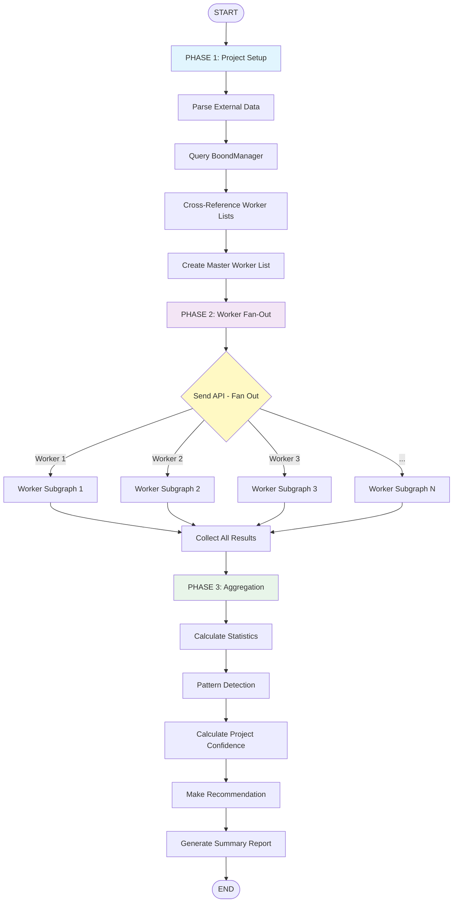
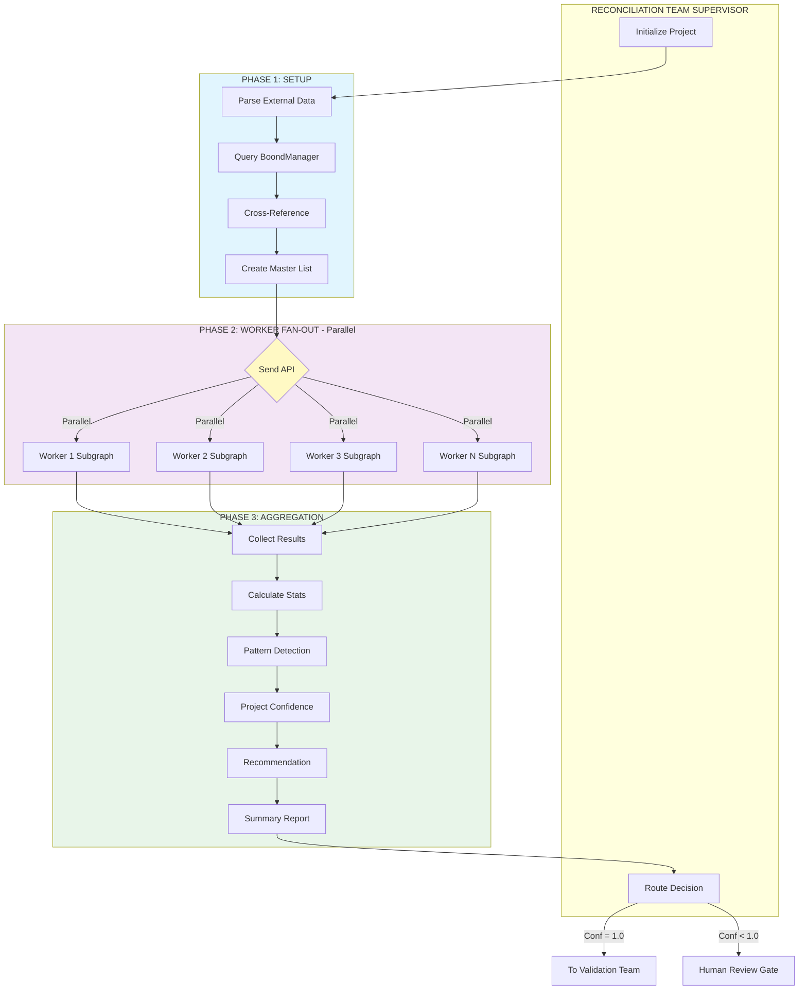
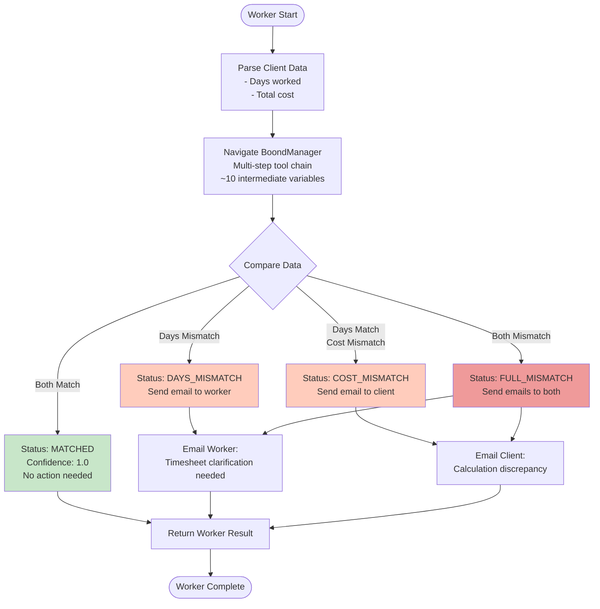
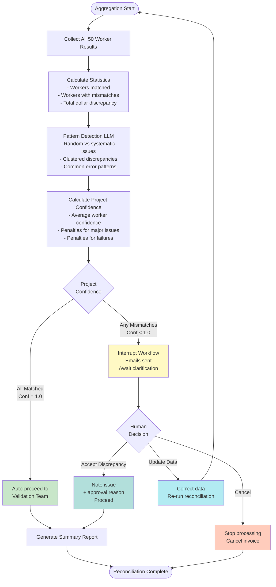

# Reconciliation Team - Detailed Design

## The Core Problem

You've got a seriously complex reconciliation challenge here. Let me break down why the original simple design won't work:

**The Complexity**:
- You're dealing with 50+ workers per project
- Each worker has about 10 different pieces of information to track and reconcile
- The external data (already provided as input) and BoondManager data cross-reference each other - meaning you need info from one source to understand the other
- The BoondManager API requires multiple endpoint calls that reference each other
- Heavy parsing needed on all this data
- You can't afford to "get lost" tracking all this state

**Why the original design fails**: Having just 4 simple agents trying to handle all 50 workers sequentially would be:
- Incredibly slow (process each worker one by one)
- Error-prone (lose track of which worker you're on)
- Hard to debug (which worker caused the failure?)
- Doesn't scale (what about 100 workers?)

## The Solution: Map-Reduce with Worker Subgraphs

Think of it like delegating work in a company:

**Bad approach**: One person processes all 50 workers sequentially, trying to remember 10 variables × 50 workers = 500 pieces of information in their head.

**Good approach**: Hire 50 specialists. Each specialist handles one worker, tracks their 10 variables, does all the cross-referencing for that worker, and reports back with a clean result. Then a manager aggregates all 50 results.

That's exactly what we're doing with LangGraph.

---

## Architecture Overview

### The Big Picture

The Reconciliation Team has three phases:

**Phase 1: Setup** - Get the project initialized and figure out which workers need reconciliation

**Phase 2: Fan-Out** - Send each worker to their own dedicated subgraph (all running in parallel)

**Phase 3: Fan-In** - Collect all the worker results and calculate a project-level confidence score

### High-Level Flow Diagram



---

## Phase 1: Project Setup

### What Happens Here

You've got your external data already (provided as input - that's great!). But you still need to:

1. **Parse the external data**: Extract the list of workers and their time/cost info
2. **Query BoondManager**: Get the project metadata and see which workers BoondManager thinks are on this project
3. **Cross-reference worker lists**: Do the worker IDs match between systems? Are there workers in one system but not the other?
4. **Create the master worker list**: This is the definitive list of workers that need reconciliation

### Why This Matters

Sometimes the external system says "Worker A, B, C worked on this project" but BoondManager says "Worker A, B, D worked on this project". You need to catch this upfront and decide: do we reconcile A, B, C, and D? Just the intersection? Flag the mismatch?

This setup phase makes those decisions before we fan out to individual workers.

---

## Phase 2: The Worker Subgraph (The Magic Part)

### The Core Idea

Every single worker gets their own dedicated subgraph. This subgraph is like a mini-workflow that:
- Has its own state (those 10 variables for that worker)
- Executes all the steps needed to reconcile that one worker
- Doesn't care about other workers
- Returns a clean, structured result at the end

### Running in Parallel

LangGraph's Send API lets you spin up 50 of these subgraphs simultaneously. So all 50 workers are being reconciled at the same time, not one after another.

**Why this is powerful**:
- Speed: 50x faster than sequential
- Isolation: Worker 23's API failure doesn't block Worker 24
- Clarity: Each subgraph only thinks about one worker
- State management: 10 variables per worker, cleanly encapsulated

### The 10-Step Worker Reconciliation Process

Each worker subgraph goes through these steps:

**Step 1: Parse External Data for This Worker**
- You've got the external data as input (awesome!)
- Extract this specific worker's time entries
- Sum up total hours
- Find their billing rate
- Calculate total cost
- Check data quality (are there missing fields? Weird values?)

**Step 2: Cross-Reference Check (External Side)**
- This is where cross-referencing comes in
- Questions like: Was their timesheet approved? Any PTO days? Are they actually assigned to this project in the external system?
- You might need to look at other parts of the external data to answer these questions

**Step 3: Fetch BoondManager Data**
- Now hit the BoondManager API
- Get this worker's time entries for the project
- Get their rate card
- Might need multiple API calls: one for time entries, one for rates, maybe one for contract details

**Step 4: Parse BoondManager Data**
- Extract and parse what you got from BoondManager
- Sum total hours
- Get billing rate
- Calculate total cost
- Assess data quality

**Step 5: Cross-Reference Check (BoondManager Side)**
- Check if the rate matches what's in the contract
- See if there were any mid-period rate changes
- Verify billing rules for this client
- Make sure the project is actually active/billable

**Step 6: Reconcile the Data**
- Now you have both sides: external and BoondManager
- Compare hours: Do they match? If not, by how much?
- Compare rates: Same hourly rate?
- Compare costs: Does the math check out?
- Document all discrepancies

**Step 7: LLM Analysis (The Smart Part)**
- Feed the discrepancies to an LLM
- Ask it: "Why might there be a 2-hour difference? Is this normal rounding? A data entry error? Something suspicious?"
- The LLM gives you a human-readable explanation and severity assessment
- This is where you go from raw numbers to actual insights

**Step 8: Calculate Worker Confidence Score**
- Based on everything you've learned, calculate a confidence score (0.0 to 1.0)
- Factors:
  - How closely do the hours match?
  - Do the rates match?
  - How good is the data quality?
  - Did the cross-reference checks pass?
- This single number tells you: how confident are we about this worker's data?

**Step 9: Categorize the Result**
- Based on the confidence score, assign a status:
  - **Matched** (>= 0.95): Perfect or near-perfect match
  - **Minor Discrepancy** (0.85-0.94): Small differences, probably acceptable
  - **Major Discrepancy** (0.70-0.84): Significant issues, needs review
  - **Failed** (< 0.70): Can't reconcile, manual intervention needed

**Step 10: Package the Result**
- Create a clean, structured output for this worker
- Include: confidence score, status, all the numbers (hours, rates, costs), list of issues, explanations from the LLM
- This gets sent back to the aggregator

### What Each Subgraph Tracks (The 10 Variables)

For each worker, the subgraph maintains:

**Identity** (3 variables):
1. Worker ID in external system
2. Worker ID in BoondManager
3. Worker name

**External System Data** (4 variables):
4. Total hours from external system
5. Billing rate from external system
6. Total cost from external system
7. Data quality score for external data

**BoondManager Data** (4 variables):
8. Total hours from BoondManager
9. Billing rate from BoondManager
10. Total cost from BoondManager
11. Data quality score for BoondManager data

(Okay, that's 11, but you get the idea - roughly 10 key pieces of info)

Plus some derived data: discrepancies, confidence scores, issue lists, etc.

---

## Phase 3: Aggregation & Project Confidence

### What Happens After All Workers Finish

You now have 50 worker results coming back from 50 parallel subgraphs. The aggregator's job:

**Step 1: Collect Results**
- Gather all 50 worker outputs
- Even if some failed, collect what you've got

**Step 2: Calculate Statistics**
- How many workers matched perfectly? (e.g., 42 out of 50)
- How many have minor issues? (e.g., 6)
- How many have major issues? (e.g., 2)
- Any complete failures? (e.g., 0)
- What's the total dollar discrepancy across all workers?

**Step 3: Pattern Detection (The Smart Part)**
- Are the discrepancies random or clustered?
- Example: If 6 workers all have the exact same 2-hour discrepancy, that's probably a systematic issue (maybe a rounding difference between systems), not 6 separate errors
- Use the LLM to spot these patterns

**Step 4: Calculate Project-Level Confidence**
- Take the average of all worker confidence scores
- Apply penalties for major issues or failures
- End up with a single project confidence score (0.0 to 1.0)

**Step 5: Make a Recommendation**
- Based on the project confidence, recommend:
  - **Auto-approve** (>= 0.95): Everything looks great, proceed
  - **Proceed with caution** (0.85-0.94): Minor issues, flag them but keep going
  - **Human review needed** (0.70-0.84): Stop and get human input
  - **Manual reconciliation** (< 0.70): Too many issues, needs hands-on attention

**Step 6: Generate Summary Report**
- Create a human-readable summary
- Example: "42 out of 50 workers matched perfectly. 6 workers have a consistent 2-hour rounding discrepancy (likely a system difference). 2 workers have larger discrepancies that need review. Recommend: Proceed to validation but flag the 2 problem workers for manual check."

---

## The Reconciliation Team Supervisor's Role

The supervisor sits above all this and:

1. **Kicks off Phase 1**: Initializes the project data
2. **Triggers Phase 2**: Uses Send API to fan out workers to subgraphs
3. **Waits for Phase 2**: All subgraphs run in parallel
4. **Kicks off Phase 3**: Once all workers are done, runs the aggregator
5. **Makes routing decision**: Based on project confidence, decides:
   - Route to Validation Team (next step)
   - Interrupt for human review
   - Mark as failed and stop

### Complete Supervisor Coordination Diagram



---

## Why This Design Solves Your Problems

### Handles Complexity
- Each worker subgraph only manages 10 variables for one worker
- No trying to track 500 variables for 50 workers in one place
- Clean separation of concerns

### Handles Scale
- 50 workers? No problem, 50 parallel subgraphs
- 100 workers? Same approach, just more instances
- Doesn't slow down with more workers (assuming you have the API capacity)

### Handles Cross-Referencing
- Each worker subgraph can do as many cross-reference checks as needed
- Has access to full project metadata for context
- Can make multiple BoondManager API calls without losing state

### Handles Parsing
- Parsing logic is in specific nodes within the subgraph
- One node for external data parsing, another for BoondManager parsing
- Clean, testable, debuggable

### Handles Errors Gracefully
- If Worker 23's reconciliation fails, it doesn't crash the whole project
- Worker 23 just gets marked as "failed"
- The other 49 workers continue
- Aggregator handles partial results

### Easy to Debug
- If there's an issue, you know exactly which worker subgraph it happened in
- Can inspect that worker's state at any step
- Can re-run just that one worker without re-processing all 50

---

## Performance Expectations

### Speed
- **Sequential approach**: 10 seconds per worker × 50 workers = 8-10 minutes
- **Parallel approach**: 30-60 seconds (limited by the slowest worker)
- **Speedup**: About 10x faster

### Resource Usage
- Each worker subgraph is lightweight (few MB of memory)
- 50 workers = maybe 2-3 GB total memory
- API calls: 5-8 per worker (250-400 total for the project)
- LLM tokens: About 500 per worker for the analysis step (25K total)

All very manageable.

---

## Error Handling Strategy

### Worker-Level Errors

**BoondManager API failures**:
- Retry 3 times with backoff
- If still failing, mark worker as "failed"
- Include error details in result
- Aggregator sees this worker failed and handles it

**Missing or bad data**:
- Parser detects missing critical fields
- Marks data quality as low
- Still tries to reconcile what it can
- Flags for human review

**Cross-reference failures**:
- Maybe the timesheet approval status is missing
- Note it as an issue
- Continue with other checks
- Lower the confidence score accordingly

### Project-Level Errors

**Too many worker failures**:
- If more than 20% of workers fail, stop the whole project
- Likely indicates a systemic issue (API down, bad data batch, etc.)
- Escalate to human: "Something's wrong, need manual intervention"

**API rate limiting**:
- If you hit rate limits, slow down the parallel processing
- Maybe batch workers: do 10 at a time instead of 50 simultaneously
- Adaptive throttling

---

## Connection to Main Architecture

This Reconciliation Team is Team #1 in the overall hierarchical architecture. After it completes:

**If project confidence >= 0.95**: Automatically route to Validation Team

**If project confidence 0.85-0.94**: Flag for review BUT still proceed to Validation Team (attach the worker issues for context)

**If project confidence < 0.85**: Interrupt the workflow, present results to human, wait for approval/rejection/edits

The output from this team (the reconciliation results) becomes input to the Validation Team.

---

## Requirements Clarification

Based on your input, here's what we're actually doing:

### What We're Reconciling

**Two data points per worker**:
1. **Days worked** (client data vs BoondManager)
2. **Total cost** (client data vs BoondManager)

That's it. No hours, no rates separately - just days and total cost.

### Zero Tolerance Policy

**Acceptance criteria**:
- Days difference: **0 days** (must match exactly)
- Cost difference: **0€** (must match exactly)

No rounding, no "close enough". Either it matches or it doesn't.

### Mismatch Handling (Human-in-the-Loop)

When there's a mismatch, the system automatically sends an email:

**Scenario 1: Days mismatch (days worked don't match)**
- **Action**: Email the worker
- **Reason**: Worker needs to clarify their timesheet
- **Example**: Client says 20 days, BoondManager says 18 days → Worker needs to explain the 2-day difference

**Scenario 2: Days match BUT cost mismatch**
- **Action**: Email the client
- **Reason**: Indicates a calculation error on client's side
- **Example**: Both say 20 days, but client says €10,000 and BoondManager says €9,500 → Client made a calculation mistake

**Scenario 3: Both days AND cost mismatch**
- **Action**: Email the worker only
- **Reason**: If both don't match, the root issue is with the worker's timesheet data, so they need to clarify first

### BoondManager Access

**Important**: There is **no single tool** that directly returns days worked and total cost.

Instead, you need to make **a chain of tool calls**, where each call uses results from previous calls. This is why the worker subgraph needs to track multiple intermediate variables (the ~10 variables).

**Example concept**:
- Tool call 1 returns data needed for tool call 2
- Tool call 2 returns data needed for tool call 3
- Each step produces variables that feed into the next step
- Eventually you derive the final days worked and total cost

The specific tool sequence and variables will be defined during implementation.

This is exactly why each worker needs their own subgraph with dedicated state management - to track all these intermediate variables without getting lost.

---

## Worker Reconciliation Process

Here's the conceptual flow (specific tools to be defined later):

### Worker Reconciliation Flow Diagram



### Step 1: Parse Client Data (Already Provided)
- Extract this worker's days worked from client input
- Extract this worker's total cost from client input

### Step 2: Navigate BoondManager (Multi-Step Tool Chain)
- Execute a sequence of tool calls
- Each tool uses results from previous tools
- Track ~10 intermediate variables along the way
- Eventually derive: total days worked and total cost from BoondManager

### Step 3: Compare
- Days match? `client_days == boondmanager_days`
- Cost match? `client_cost == boondmanager_cost`

### Step 4: Determine Action
- **Both match**: Status = "matched", confidence = 1.0, no action needed
- **Days mismatch**: Status = "days_mismatch", send email to worker
- **Days match, cost mismatch**: Status = "cost_mismatch", send email to client
- **Both mismatch**: Status = "full_mismatch", send emails to both

### Step 5: Send Email (If Needed)
- Use email tool to send appropriate notification
- Include: worker name, project, discrepancy details, request for clarification

### Step 6: Return Result
- Worker status (matched/days_mismatch/cost_mismatch/full_mismatch)
- Discrepancy details (what didn't match and by how much)
- Email sent confirmation

---

## Updated Aggregation Logic

### Aggregation Flow Diagram



After all 50 workers are reconciled:

**Project passes reconciliation if**:
- All 50 workers have status "matched"
- Confidence = 1.0
- Proceed to Validation Team

**Project requires clarification if**:
- Any workers have mismatch status
- Emails have been sent to workers/clients
- Workflow pauses (interrupt) until clarifications received
- Human reviews responses and either:
  - Updates data and re-runs reconciliation
  - Approves proceeding despite mismatch (with documentation)
  - Rejects and stops the invoice

**Summary report includes**:
- Total workers: 50
- Matched workers: 48
- Days mismatches: 1 (emails sent to workers: [Worker A])
- Cost mismatches: 1 (emails sent to clients: [Client XYZ for Worker B])
- Status: Awaiting clarification

---

## Email Notification Templates

### Email to Worker (Days Mismatch)

```
Subject: Timesheet Clarification Needed - Project {project_name}

Hi {worker_name},

We're processing invoices for {billing_period} and found a discrepancy
in your timesheet for {project_name}.

Our records show:
- Client reported: {client_days} days worked
- BoondManager shows: {boondmanager_days} days worked
- Difference: {difference} days

Please review your timesheet and confirm which is correct.

Reply to this email with clarification.

Thanks,
HR Automation System
```

### Email to Client (Cost Mismatch)

```
Subject: Invoice Calculation Discrepancy - {worker_name}

Hi {client_contact},

We're preparing invoices for {billing_period} and noticed a calculation
discrepancy for {worker_name} on {project_name}.

Both systems agree on days worked ({days} days), but the cost differs:
- Your records: {client_cost}€
- Our calculation: {boondmanager_cost}€
- Difference: {difference}€

This likely indicates a calculation or rate error. Could you please verify?

Best regards,
HR Automation System
```

---

## Integration with Overall Workflow

**Reconciliation Team completes**:
- If all workers matched → Auto-proceed to Validation Team
- If any mismatches → Emails sent, workflow interrupts, human reviews

**Human resume options**:
1. **Accept discrepancy**: Note the issue but proceed (requires approval reason)
2. **Update data**: Correct the client or BoondManager data, re-run reconciliation
3. **Cancel invoice**: Stop processing this project

This keeps the reconciliation logic simple, strict, and human-overseen when needed.

---

## Next Steps

With this clarification, we now understand:
- ✅ What we're reconciling (days + cost)
- ✅ Tolerance (zero tolerance)
- ✅ Error handling (email notifications)
- ✅ BoondManager access (via tools)

Ready to move to the **Validation Team** design, or do you want to refine the reconciliation approach further?
